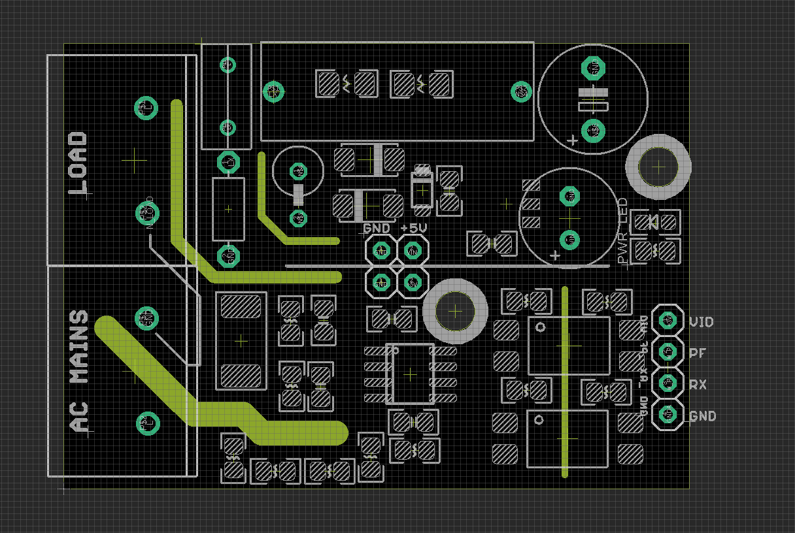

# SVC1031 DAT

- legacy wiki page: https://w.electrodragon.com/w/Category:Energy_Meter#Documents
- https://www.electrodragon.com/product/energy-meter-hlw8032-breakout-board/

## Pin Definitions 

- VDD
- PF
- RX
- GND 

## Features 
- On board AC-DC Power Supply Converter
- Isolated signal output

## R2 Version Update:
- Main image is the R2 version.
- Default use capacitive dropper method as non-isolation AC-DC power supply, supply current up to 100mA. Add fuse and varistor general protection.
- Previous ACDC power supply method MP150 is still also available, current supply up to 200mA, further improve reliablility.
- HLW8032 energy measurement on board one side, and ACDC power supply on other side
- Add ACDC power supply LED indicator.
- Add jumper between ACDC power supply and supply for HLW8032. You can test HLW8032 with your lab power via jumper pin header.
- We may soldered the cables for testing purposes, you can remove them later or add notes to ask us to do so.

## REF

- [[ACDC-RC_Buck-dat]] - [[MP150]]

