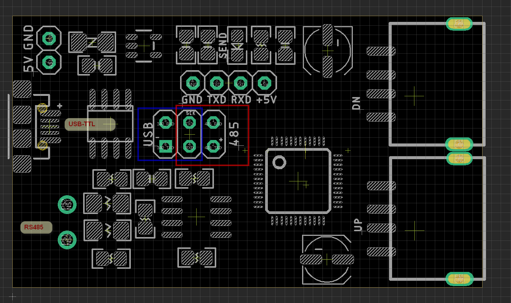

# USB1003 DAT

- 5V/GND external power supply
- blue box: chip output to USB
- red  box: chip output to RS485

## check points

- RS485 no output? 
  - please check if the jumper is set to red box
  - USB and RS485 output can not be selected in the same time.

## urls 

- https://www.electrodragon.com/product/usb-hid-to-uart-rs-485-extension-board/
- v1 documentation: https://www.electrodragon.com/w/CH9350

