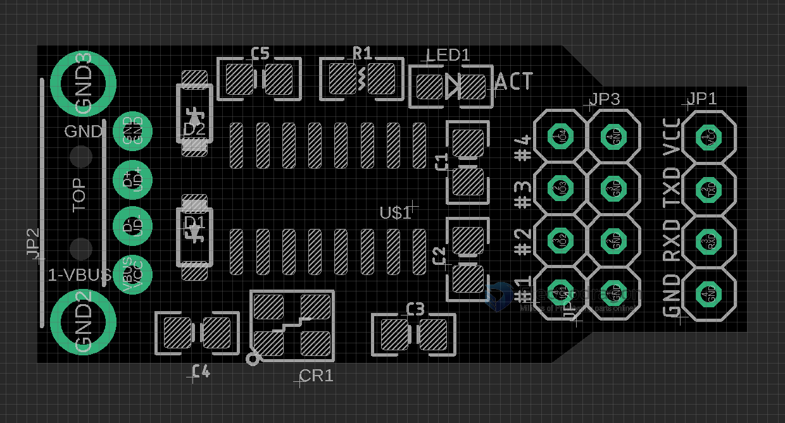

# USB1006 

- baudrate 9600

First can you double check the output signal is RS232 or TTL? The correct  input signal should be TTL, which differs from RS232. 

You have to find a USB-TTL testing bridge cable or PCB Board to test, for example, CH340, FT232, CP210x. 

- [[USB-TTL-dat]]

## Wriing 

The wiring please try: 

- your device TXD -> “Serial to HID Keyboard Emulator” RXD
- your device RXD -> “Serial to HID Keyboard Emulator” TXD
- GND - GND

## Result 
And last, you need to send by hexadecimal from your device, and receive a text string on the USB HID side.
e.g. 

    0x48 0x65 0x6c 0x6c 0x6f -> Hello (open a text editor to see)

Best regards,

