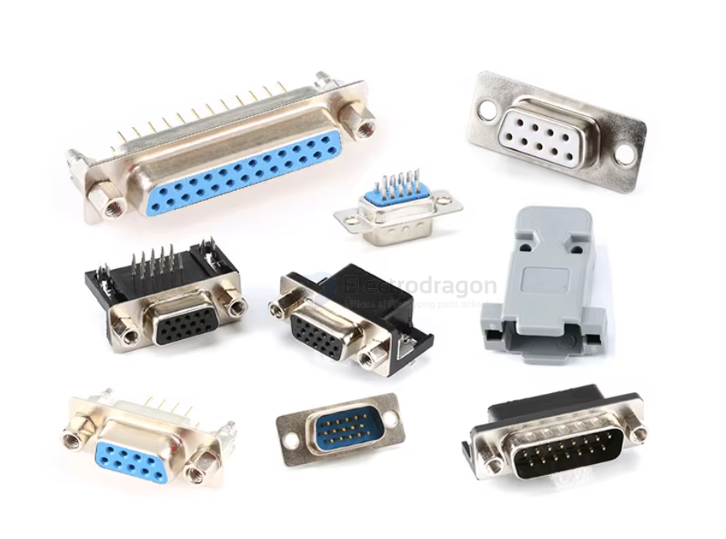
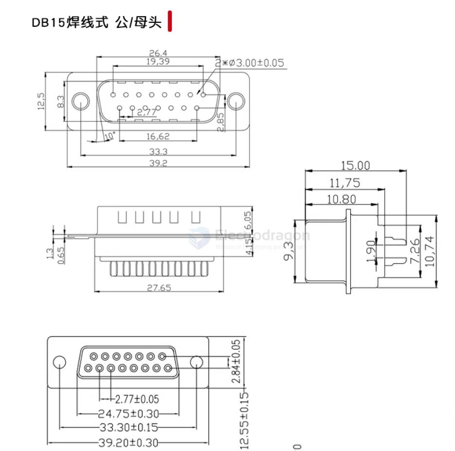
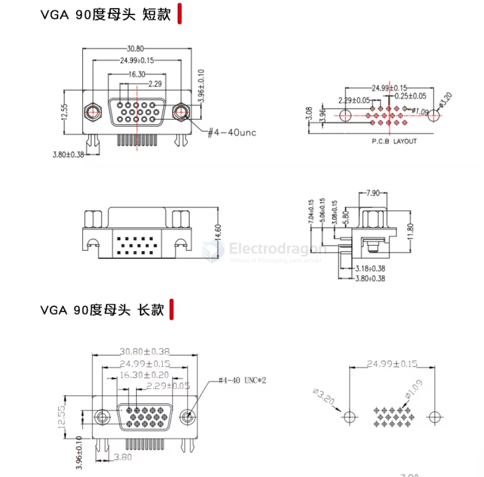
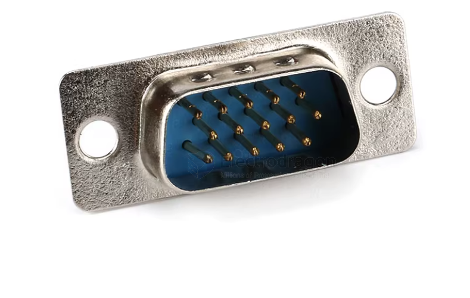
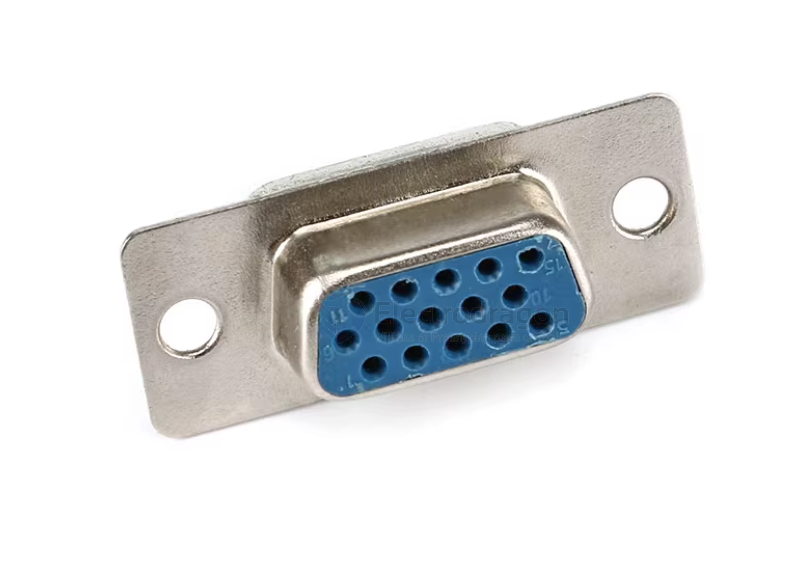

# CONN-DB-series-dat

- [[DB9-dat]] 

- [[DB9-dat]] - [[DB15-dat]] - [[DB25-dat]] - [[CONN-dat]]

- [[VGA-dat]] - [[CONN-DB-series-dat]]

DB15-2-row
DB15-3-row

## Series 

DB9-母头_焊线式

DB9-公头_焊线式

DB15-母头_焊线式

DB15-公头_焊线式

DB25-母头_焊线式

DB25-公头_焊线式

DB9-母头_焊线式_白胶镀金

DB9-公头_焊线式_白胶镀金

DB9-母头_插板式

DB9-公头_插板式

DB9-母头_刺破压接式

DB9-公头_刺破压接式

DB9配套外壳_塑料壳

DB15配套外壳_塑料壳

DB25配套外壳_塑料壳

DB9配套外壳_金属壳

DR9-母头_90度插板式

DR9-公头_90度插板式

DR15-母头_90度插板式

DR15-公头_90度插板式

DR25-母头_90度插板式

DR25-公头_90度插板式

VGA三排15P-母头_焊线式

VGA三排15P-公头_焊线式

VGA三排15P-母头_90度_短款蓝色

VGA三排15P-母头_90度_长款黑色

VGA三排15P-母头_90度_长款蓝色

DP9(双排9P)-母头_插板式

DP9(双排9P)-公头_插板式

DP15(双排15P)-母头_插板式

DP15(双排15P)-公头_插板式

DP15(三排15P)-母头_插板式

DP15(三排15P)-公头_插板式

DP25(双排25P)-母头_插板式

DP25(双排25P)-公头_插板式

DP37(双排37P)-母头_插板式

DP37(双排37P)-公头_插板式