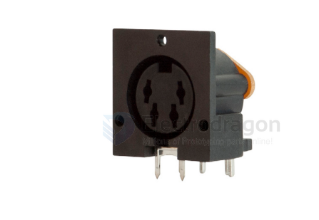
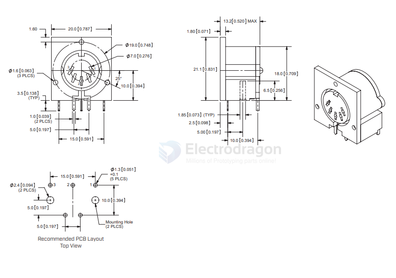

# CONN-DIN-dat

- [[CONN-dat]] - [[CONN-DIN-dat]]

## board 

sds-j

Pin Options

- 30* = 3 pins
- 40 = 4 pins
- 50 = 5 pins, 180 degrees
- 60 = 6 pins
- 70 = 7 pins
- 80 = 8 pins

SDD-130J = 13 pins

https://www.sameskydevices.com/product/resource/sds-j.pdf

## ref 

