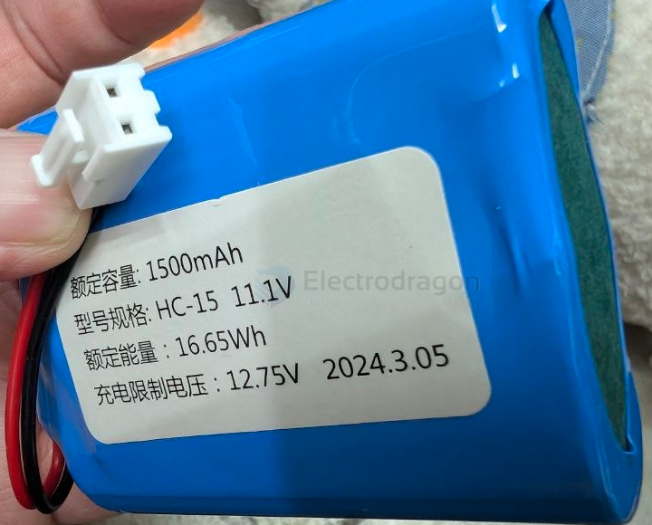
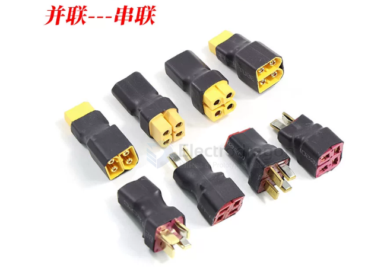

# CONN-RC-dat

- [[EC3-cat]] - [[TRX-dat]] - [[EC5-dat]]

- [[XT60-dat]] - [[XT30-dat]] - [[cable-XT-dat]] - [[CONN-XT-dat]] - [[CONN-power-dat]]

- [[CONN-bullet-dat]] - [[CONN-deans-dat]] - [[CONN-deans-dat]] - [[CONN-tamiya-dat]]

- [[RC-standard-dat]] - [[standard-dat]] - [[RC-dat]]

- [[CONN-power-dat]] - [[conn-battery-dat]] - [[conn-rc-dat]] - [[CONN-dat]] - [[pitch-dat]]
  
- [[CONN-deans-dat]] - [[CONN-tamiya-dat]]

- [[molex-dat]] - [[51006-0200-dat]] - [[pitch-dat]] - [[CONN-dat]] - [[CONN-RC-dat]]

- 1.25MM公插头 - [[GH1.25-dat]] ??? 
- 1.25MM母插头反向 - [[GH1.25-dat]] ??? 
- 1.25MM母插头正向 - [[GH1.25-dat]] ??? 

- 黑色SM插头 - [[SM2.54-dat]]
- 红色JST插头 - [[CONN-JST-dat]]
- 圆头2.5MM插头 - [[CONN-DC-barrel-jack-dat]] - [[CONN-power-dat]]
- 51005白色2针插头 - [[51006-0200-dat]]

- 5V USB充电座不带数据线 - [[CONN-USB-dat]]

- 白色3针插头 - [[XH2.54-dat]]
- 4针插头 - [[XH2.54-dat]]

- 2.0MM插头 正向 - [[PH2.0-dat]]
- 2.0MM插头 反向 - [[PH2.0-dat]]

## VH3.96 

- [[CONN-VH3.96-dat]] - [[pitch-dat]] - [[CONN-RC-dat]] - [[wire-to-board-dat]] - [[CONN-dat]]

## combined connector 

## ref 

