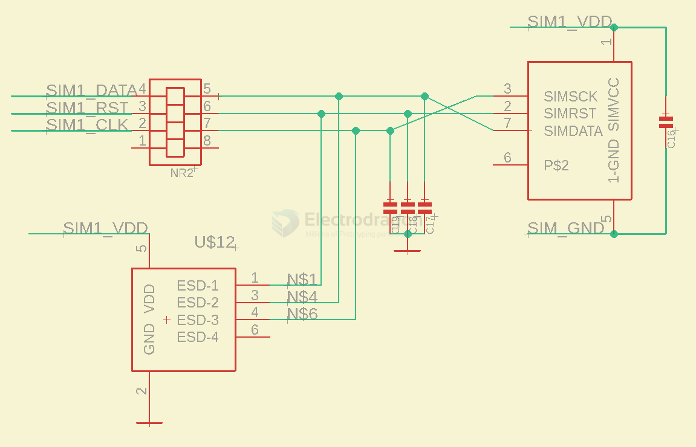
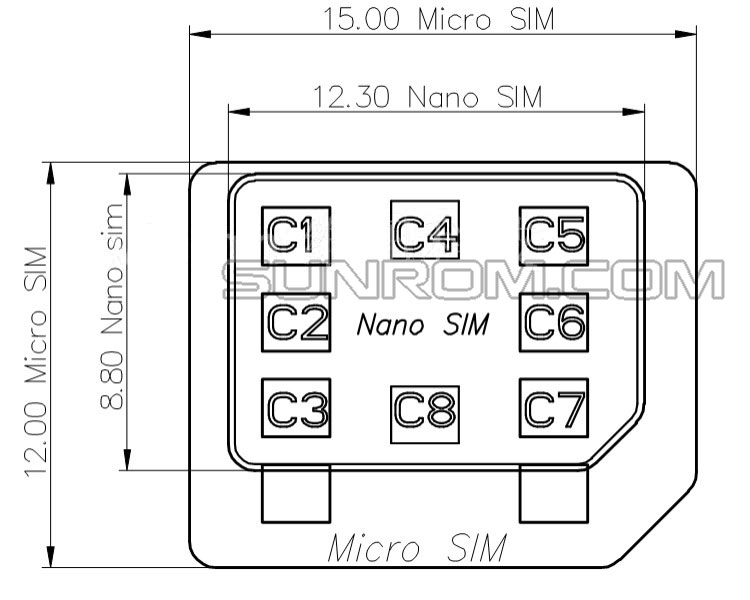
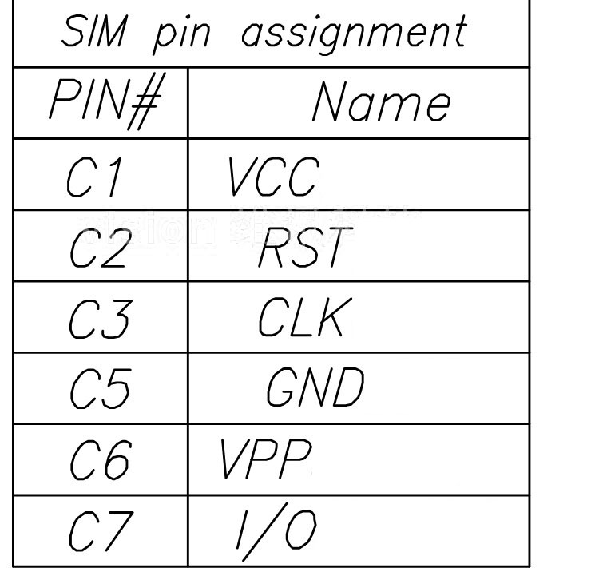
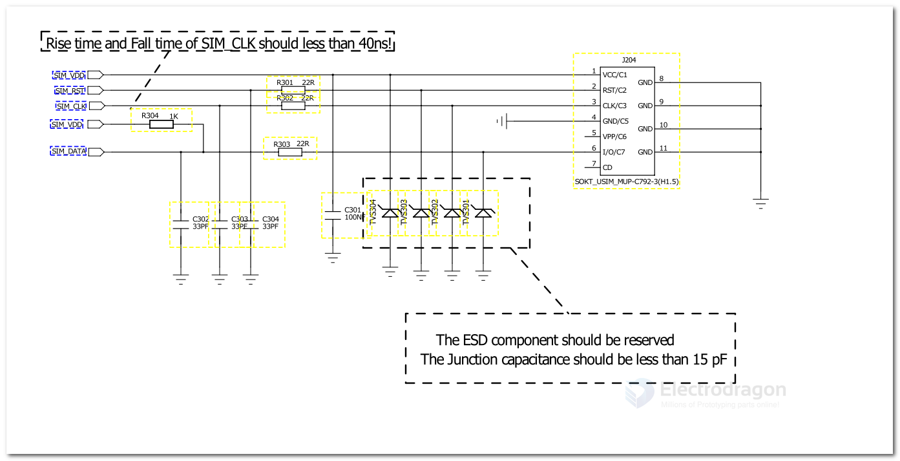
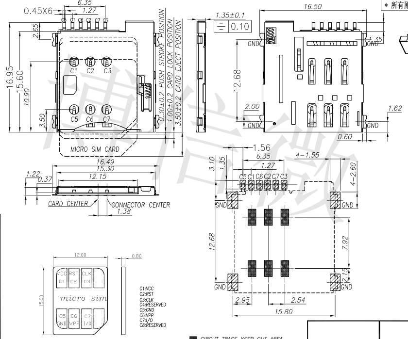
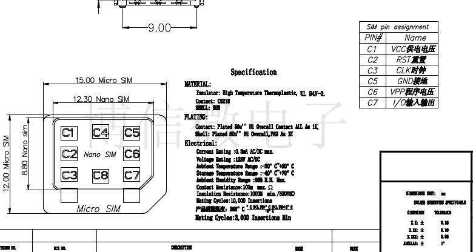
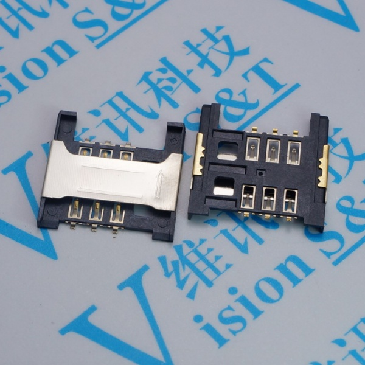

# CONN-SIM-dat

- [[SIM]] - [[CONN-SIM-dat]]

## circuits 

## pin definitions 

C1 = VCC
C2 = RST
C3 = CLK
C5 = GND
C6 = VPP
C7 = IO

## sim-card-dat

SIM_VDD

w/current limit resistor, filter cap
- SIM_DATA -> pull-up to SIM_VDD by 1K
- SIM_RST
- SIM_CLK

## sim holder dat 

- [[sim-card-dat]] - [[SIM_Holder-dat]] - [[SIM-dat]] - [[SIM]]

We only use one kind of sim card, which is the nano type. It is the normal type used on iphone or most common modern phone.

### Nano Sim 

### micro sim

### Common Sim

## REF 

- [[SIM_Holder-dat]] - 注意事项 = [[SIM]]