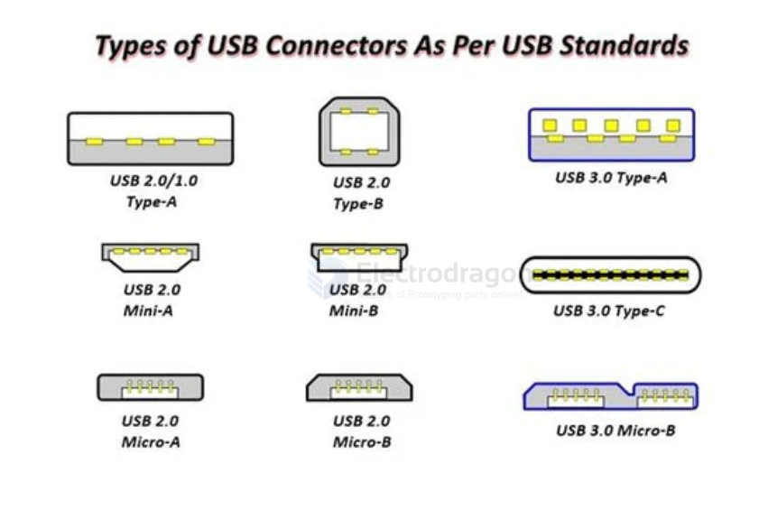
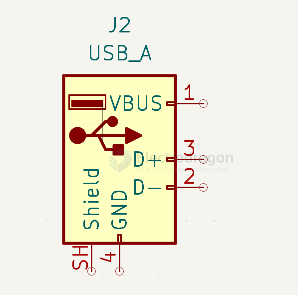
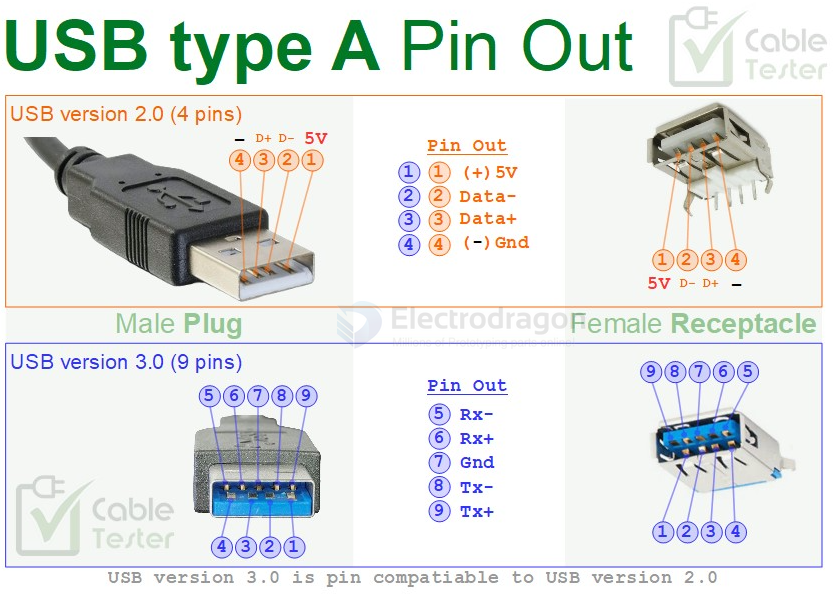
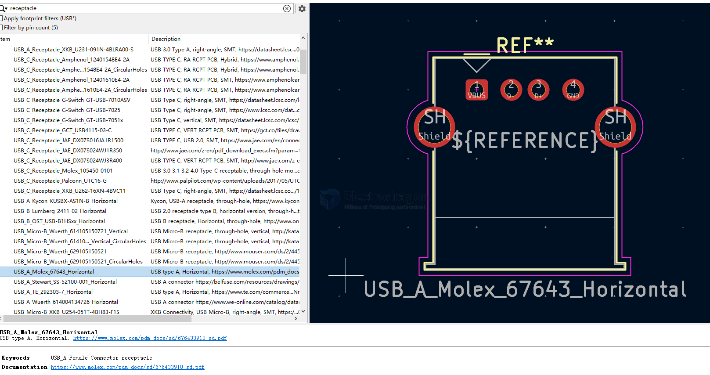
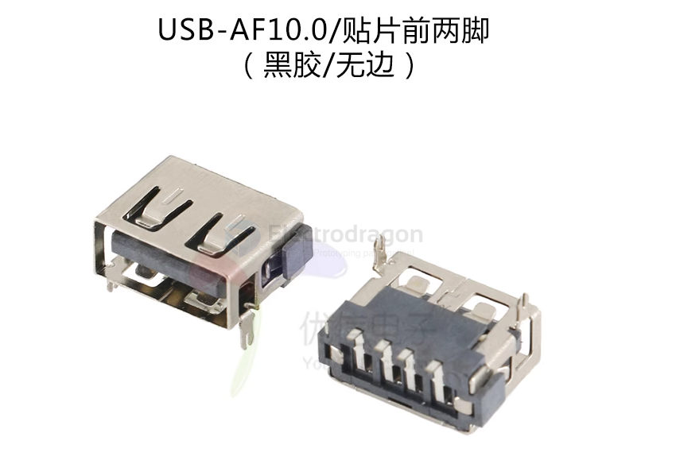
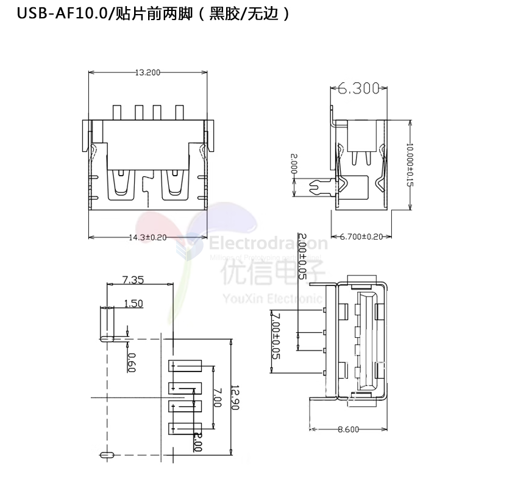
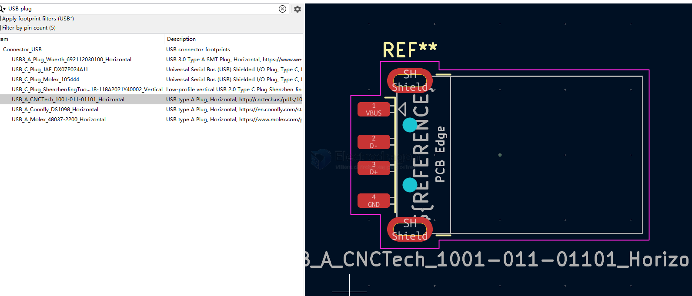
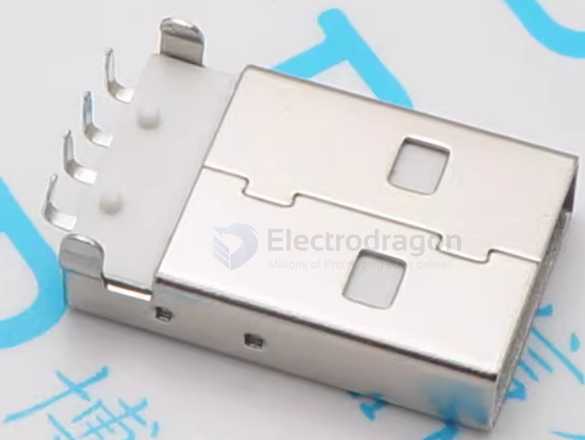
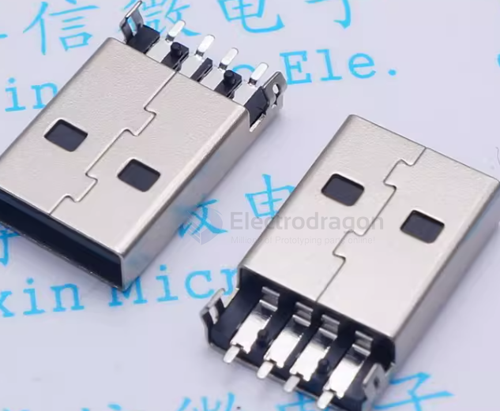

# CONN-USB-A-dat

- [[CONN-USB-A-dat]] - [[USB-HOST-dat]] - [[USB-device-dat]] - [[CONN-USB-dat]]

- [[CONN-USB-receptacle-dat]] - [[CONN-USB-plug-dat]] - [[CONN-USB-A-dat]] - [[kicad-footprint-dat]]

## type-A 

symbol == USB_A == USB Type A connector

## type-A Female == receptacle

VBUS | D- | D+ | GND

## type-A male == plug 

VBUS | D- | D+ | GND

board sinked 

## ref 

- [[CONN-USB]] - [[USB-A]] - [[CONN]]
