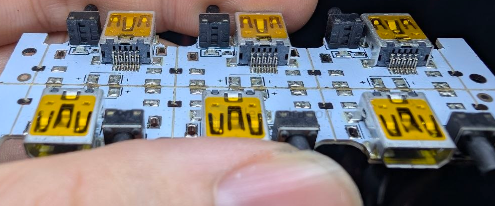

# CONN-USB-mini-dat

- [[CONN-USB-dat]] - [[CONN-USB-micro-dat]] - [[CONN-USB-mini-dat]] - [[CONN-USB-type-c-dat]]

## classic 

- [[CONN-USB-mini-dat]]

1. The Custom Digital Camera Interface (Most Common)
   
During the 2000s and early 2010s, camera manufacturers like Sony, Olympus, Panasonic, and Nikon didn't want to put separate USB ports and analog TV/Audio output ports on their compact cameras to save space.

Instead, they took the standard Mini-USB shape and designed custom 10-pin proprietary variants (often called UC-E6 or extended Mini-B variants).

How it works: 5 of the pins handle standard USB data and power when plugged into a PC. The other 5 pins carry analog video (composite RCA) and stereo audio signals for plugging directly into an old CRT television.

2. Mini-USB 3.0 (Rare External Hard Drive Cable)

Before USB-C completely took over, there was a brief, awkward transitional period where manufacturers wanted to bring high-speed USB 3.0 transfer rates to small portable devices like external hard drives.

How it works: Standard USB 2.0 only requires 4 or 5 pins. To achieve USB 3.0 SuperSpeed (5 Gbps), an extra 5 pins are required for the separate high-speed data lanes.

The result: They engineered a 10-pin Mini-USB connector. It retains the blocky trapezoid silhouette of the original Mini-B but features a dense, dual-layer row of 10 internal contact pins.

💡 Compatibility Note: Interestingly, with these 10-pin Mini-B female ports, you can usually still plug a standard old-school 5-pin Mini-USB cable into them for basic charging or slow data syncing, because the physical outer shell dimensions match up perfectly. However, the custom 10-pin cables themselves are completely non-interchangeable between different brands.

## ref 

