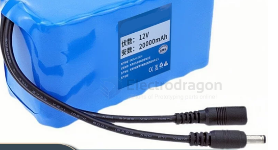
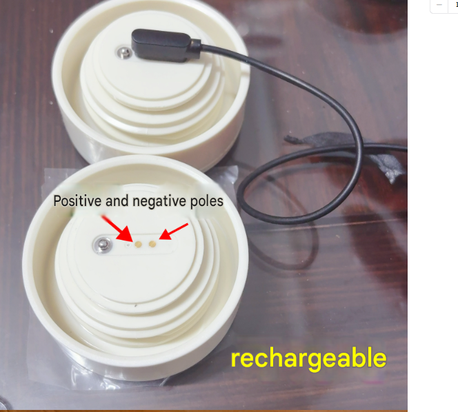

# CONN-battery-dat

- [[CONN-power-dat]] - [[conn-battery-dat]] - [[conn-rc-dat]] - [[CONN-dat]] - [[pitch-dat]]
  
- [[CONN-deans-dat]] - [[CONN-tamiya-dat]]

- [[CONN-JST-dat]] - [[SM2.54-dat]]

- [[CONN-XT-dat]] - [[CONN-deans-dat]]

- [[wire-to-wire-dat]]

- [[EL4.5-dat]] - [[L6.2-dat]] == 田宫头 

EC5-F EC5-M 航模插头连接线 大电流100 动力电池 香蕉 插头

## common battery output 

- [[conn-dc-barrel-jack-dat]] == female + male 

- [[conn-XLR-dat]]

## portable device battery charging 

- [[vacuum-flask-dat]]

## ref 

- [[battery-dat]]