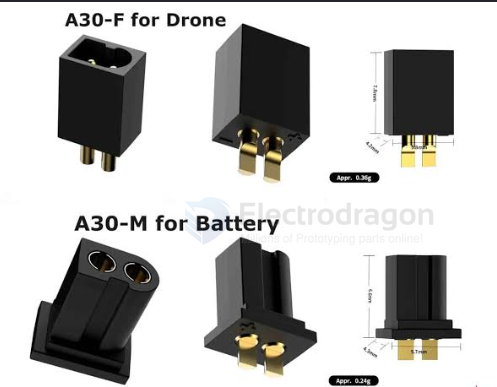

# CONN-A30-dat

- [[CONN-A30-dat]] - [[PH2.0-dat]] - [[CONN-power-dat]] - [[FPV-build-dat]] - [[battery-FPV-dat]] - [[battery-1S-dat]] 

GNB A30 是由電池製造商高能（Gaoneng, 簡稱 GNB）推出的一款專為 1S 穿越機（Tinywhoop 小煙風） 設計的高性能微型電池接頭（Connector）。 

它旨在解決傳統 PH2.0 接頭容易導電不足和壓降嚴重的問題。

以下是 GNB A30 的核心特點：

`高性能傳導`：採用金屬實心插針（Solid Pins）設計，電阻僅 1.6mOhm。它能支持高達 15A 的持續電流，遠超傳統 PH2.0 的 4.5A，能大幅減少大油門時的電壓驟降（Voltage Sag），釋放 1S 電池的極致動力。

`相容性`：A30 與 BetaFPV 的 BT2.0 接頭相互通用。帶有 A30 接頭的電池可以直接插在 BT2.0 的充電器或無人機上使用。

`耐用度高`：比起 PH2.0 的捲曲插針，A30 的結構更不容易鬆動損壞，使用壽命更長。

`特殊定義（公母反轉）`：GNB 在 A30 的公母頭定義上與傳統習慣相反：電池端使用的是公頭（Male），而無人機端使用的是母頭（Female）。在購買 DIY 配件時需要特別留意。

目前市場上許多 1S 的高航時/高倍率電池（如 GNB 380mAh、450mAh、550mAh 等）均已原生標配 A30 接頭。

## ref 

