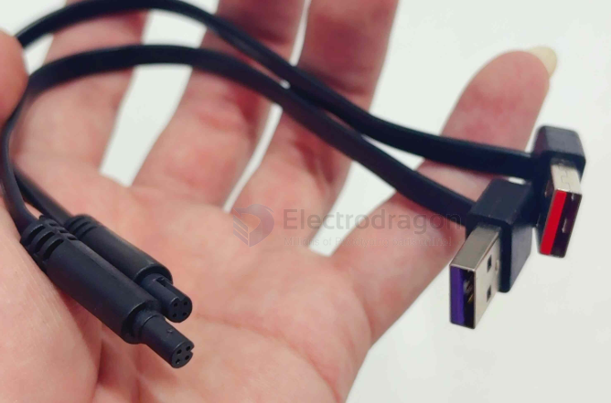
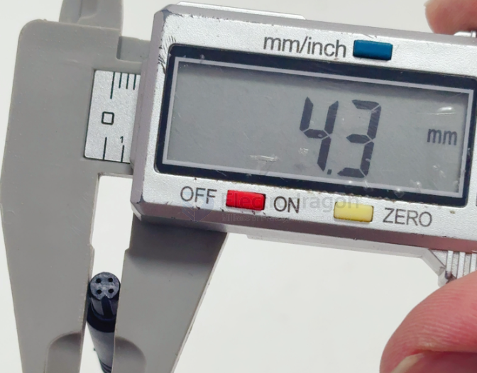

# CONN-XLR-dat.md

- [[CONN-XLR-dat]] - [[analog-dat]] - [[CONN-USB-dat]] - [[video-dat]] - [[sensor-camera-dat]] - [[camera-analog-dat]]

## build 

## pins 

- 3-pin
- 4-pin 

## Advantages of XLR Connectors

XLR connectors are the industry standard for professional audio and certain high-end data applications. Their design offers specific mechanical and electrical advantages that ensure signal integrity and hardware durability.

---

## **1. Balanced Audio Signal**
The most significant advantage is the ability to carry a **balanced signal**, which is essential for professional environments.

*   **Noise Rejection:** An XLR cable typically uses three pins: ground, positive (hot), and negative (cold). It uses **Differential Signaling** to cancel out electromagnetic interference (EMI) and radio frequency interference (RFI).
*   **Long Cable Runs:** Because the balanced design cancels noise, you can run XLR cables for 30 meters or more without signal degradation. In contrast, unbalanced cables (like RCA) usually pick up "hum" after just a few meters.

---

## **2. Robust Locking Mechanism**
Unlike standard 6.35mm jacks or USB connectors that rely on friction, XLR connectors feature a **spring-loaded locking latch**.

*   **Physical Security:** Once plugged in, the connection is locked. You must press a release tab to unplug it. This prevents accidental disconnections during live events or in mobile robotics/machinery.
*   **Durability:** The housings are typically made of zinc alloy or high-strength plastic, designed to withstand heavy use, being stepped on, or dropped in rugged field conditions.

---

## **3. "Make-First, Break-Last" Grounding**
The design of the pins provides a specific safety feature known as "Make-First, Break-Last."

*   **Pin 1 Priority:** If you look at a male XLR connector, Pin 1 (the ground pin) is slightly longer. This ensures that the ground connection is established **before** the signal pins make contact.
*   **Equipment Protection:** This prevents loud electrical "pops" or surges that could damage sensitive speakers, amplifiers, or microcontrollers when plugging equipment in while it is powered on (hot-swapping).

---

## **4. Phantom Power & Standardization**
*   **Power Delivery:** XLR is the standard interface for delivering **48V Phantom Power** to condenser microphones, removing the need for external batteries.
*   **Daisy-Chaining:** Because they have distinct male and female ends, you can easily connect multiple cables together to extend their reach without needing gender-changers or special adapters.
*   **Universal Standard:** The pin configuration is a global standard (Pin 1: Ground, Pin 2: Positive, Pin 3: Negative), ensuring compatibility across all professional hardware worldwide.

---

## **Summary Comparison**

| Feature | XLR (Balanced) | 6.35mm / RCA (Unbalanced) |
| :--- | :--- | :--- |
| **Interference** | Excellent Noise Rejection | High Sensitivity to Noise |
| **Security** | Locking Latch | Friction Fit (Easily Pulled Out) |
| **Max Length** | 50m+ | Typically <6m |
| **Durability** | High (Pro Grade) | Moderate (Consumer Grade) |

## ref 

