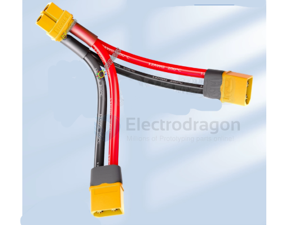
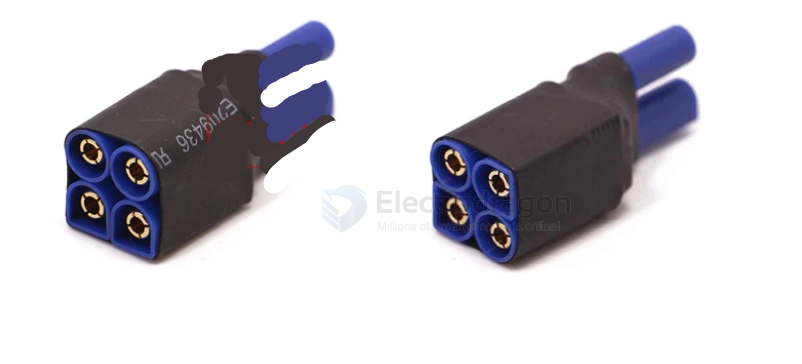

# CONN-XT-dat

- [[conn-rc-dat]] - [[CONN-power-dat]]

- [[cable-XT-dat]] - [[CONN-XT-dat]] - [[CONN-power-dat]] - [[CONN-deans-dat]]

### XT90 

### XT60

额定电流：60A

接触材质：镀金铜

常用于中大型无人机、RC汽车、电动工具

### XT30

额定电流：30A

更小巧，适合微型无人机、轻量RC设备

## combination cable 

connector 

## ref 

- [[CONN-power-dat]]