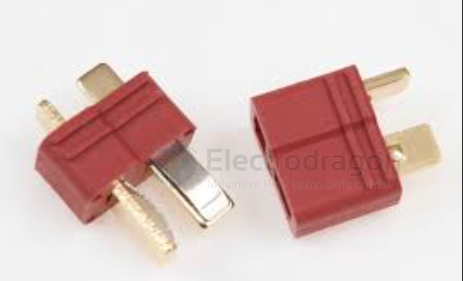

# CONN-deans-dat

- [[CONN-power-dat]] - [[conn-battery-dat]] - [[conn-rc-dat]] - [[CONN-dat]] - [[pitch-dat]]
  
- [[CONN-deans-dat]] - [[CONN-tamiya-dat]]

A Deans connector (often called a T-plug) is a highly popular electrical connector primarily used in hobby-grade RC vehicles, drones, and airsoft guns. They are praised for their low-resistance gold-plated copper contacts and compact, space-saving design.

## ref 

