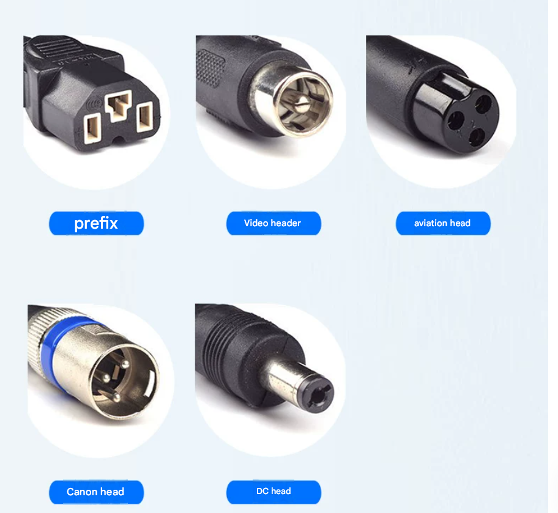
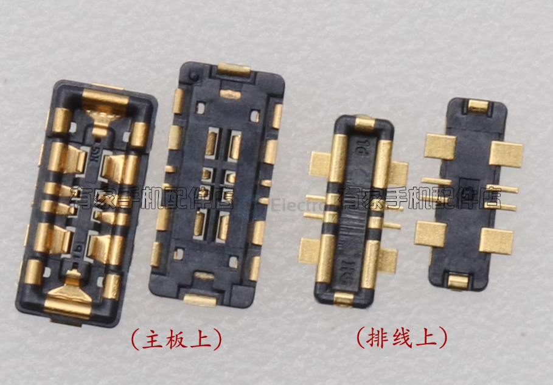
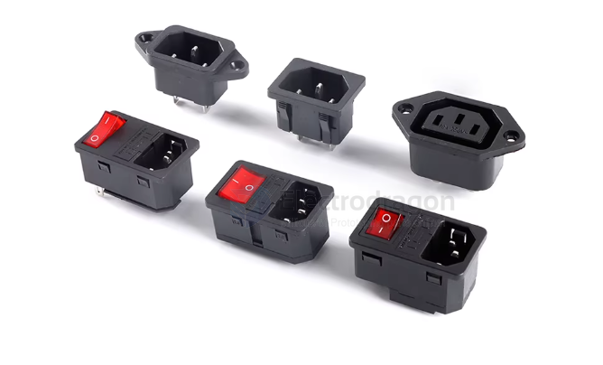

# CONN-power-dat

- [[CONN-XLR-dat]] - [[analog-dat]] - [[CONN-USB-dat]] - [[video-dat]] - [[sensor-camera-dat]] - [[camera-analog-dat]]

- [[conn-power-dat]] - [[cable-power-dat]] - [[pitch-dat]]

- [[CONN-DC-barrel-jack-dat]]

- [[copper-lug-dat]]

MR/MT/XT30/60/90/150 Lithium Battery Controller Motor Charger Power Connector AM/AS/EC

- [[XT60-dat]] - [[XT30-dat]] - [[CONN-XT-dat]]

- [[HSC-dat]]

- [[Spade-Terminal-dat]]

- [[DJI-dat]] - [[SDC-dat]]

## common battery header connector

## phone connector 

- [[phone-pixel-dat]]

## AC power CONN 

## tools mechanical power CONN

- [[tools-mechanical-power-dat]] - [[battery-5s-dat]] - [[CONN-power-dat]] - [[CONN-tools-mechanical-power-dat]]

## undefined connector 

- [[jieli-dat]]

## portable device battery charging 

## ref 

- [[CONN-dat]] - [[pitch-dat]]

- [[conn-power]] - [[conn]]