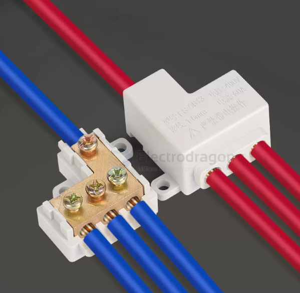
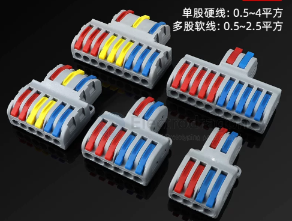
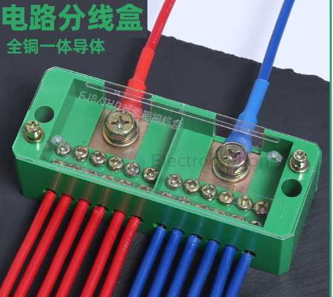
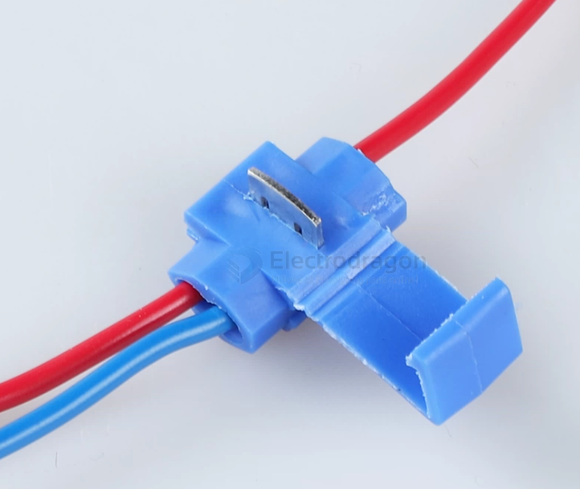
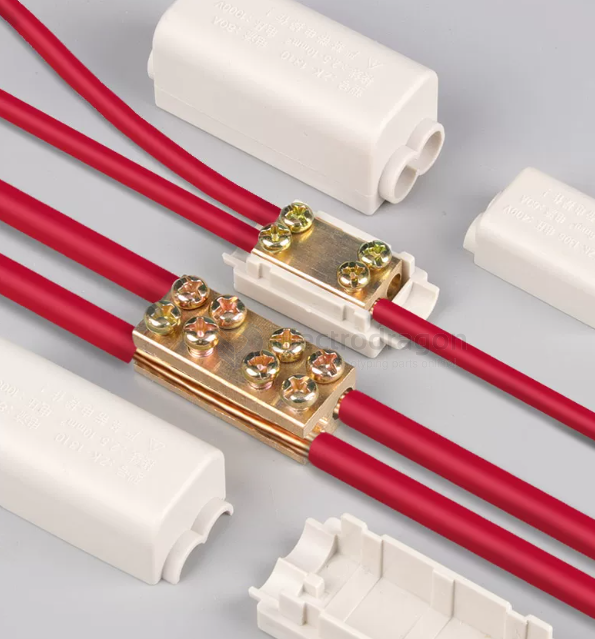

# CONN-power-seperation-dat.md

- [[conn-rc-dat]] - [[CONN-power-dat]]

## 并线端子 

一进二出丨1-6平方丨FS-306

- [[CONN-power-dat]] - [[CONN-power-seperation-dat]] - [[CONN-XT-dat]]

- [[cable-BV-dat]] - [[cable-BVR-dat]] - [[cable-RV-dat]] 
  
- [[cable-dat]] - [[cable-power-dat]]

## ref 

