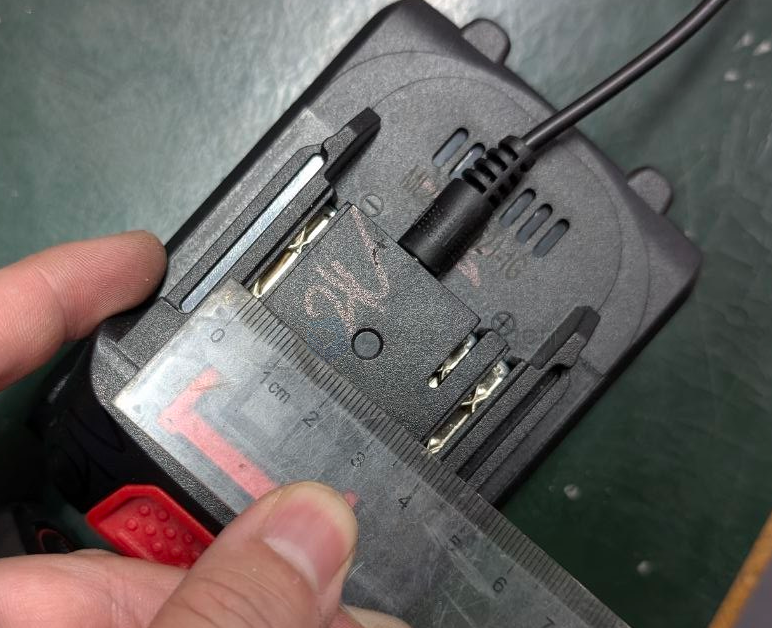

# CONN-tools-mechanical-power-dat

- [[tools-mechanical-power-dat]] - [[battery-5s-dat]] - [[CONN-power-dat]] - [[CONN-tools-mechanical-power-dat]]

## build 

socket pitch 18 mm 

socket pitch 38 mm 

socket pitch 21 mm

## ref 

- [[conn-power]] - [[CONN-tools-mechanical-power]]