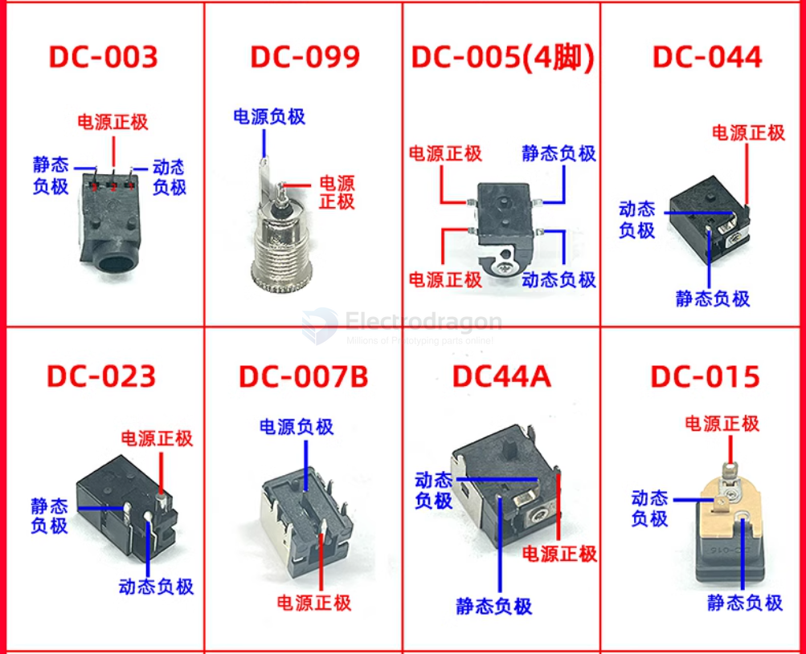
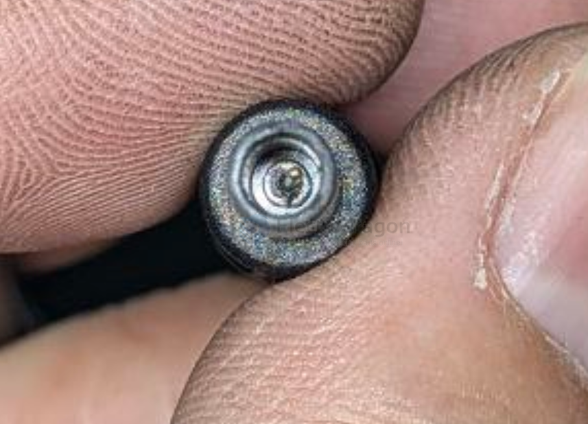

# DC-barrel-jack-dat

- [[CCO3548-dat]] == 5.5-2.1mm DC barrel jack, 5.5mm outer diameter, 2.1mm inner diameter == https://www.electrodragon.com/product/dc-power-jack-male/

- [[CCO3546-dat]] 5.5-2.1mm - [[CCO3547-dat]] 3.5-1.35mm DC barrel jack, 3.5mm outer diameter, 1.35mm inner diameter == https://www.electrodragon.com/product/20pcs-dc-5-5mm-female-pcb-power-jack-pole/

- [[CCO3527-dat]] - 10PCs DC Male to Cable Terminal Connector - https://www.electrodragon.com/product/5pcs-dc-male-cable-connector/

- [[CPP1012-dat]] - 10PCs Panel/Wall Mounted DC Power Connector (5.5-2.1mm) - https://www.electrodragon.com/product/panel-wall-mounted-power-female-connector-5-5-2-1-mm/

- [[fab-workspace-dat]]

- [[DC-barrel-jack]] - [[CONN]]

# power-jack-dat

- https://www.electrodragon.com/product/20pcs-dc-5-5mm-female-pcb-power-jack-pole/

- plug-head: https://www.electrodragon.com/product/dc-power-jack-male/

- [[CPP1012-dat]] - [[CCO3546-dat]] - [[CCO3548-dat]] - [[CCO3527-dat]] 

## common kit 

ten in one 

comprehensive [[laptop-dat]] [[dc-barrel-jack-dat]] kit 34 in 1 

## Power Jack List 

| Part Number | Outer | Inner | Specification                       |
| ----------- | ----- | ----- | ----------------------------------- |
| DC-099      | 5.5   | 2.1   | DC Power Socket                     |
| DC-099      | 5.5   | 2.5   | DC Power Socket                     |
| DC-099      | 5.5   | 2.1   | DC Power Socket with Thread         |
| DC-099      | 5.5   | 2.5   | DC Power Socket with Thread         |
| DC003A      | 3.5   | 1.3   | DC Power Socket                     |
| DC003       | 3.5   | 1.3   | DC Power Socket Flat                |
| DC005       | 5.5   | 2.1   | SMD 4-Pin                           |
| DC005       | 5.5   | 2.5   | SMD 4-Pin                           |
| DC-099      | 5.5   | 2.1   | DC Power Socket with Waterproof Cap |
| DC-099      | 5.5   | 2.5   | DC Power Socket with Waterproof Cap |
| DC-044      | 5.5   | 2.1   | Power Connector                     |
| DC023       | `4.4` | 1.65  | Power Socket (ID: 4.0×1.7)          |
| DC-007B     | 5.5   | 2.1   | Iron Shell Bracket                  |
| DC-007B     | 5.5   | 2.5   | Iron Shell Bracket                  |
| DC44A       | 5.5   | 2.1   | DC Power Socket                     |
| DC-015      | 5.5   | 2.1   | Power Socket                        |
| DC031A      | N/A   | N/A   | SMD 4-Pin Power Socket              |
| DC-011C     | `2.5` | 0.7   | 5-Pin SMD Socket                    |
| DC-012      | 5.5   | 2.5   | Power Socket                        |
| DC-005      | 5.5   | 2.1   | 2-Pin Power Socket                  |
| DC-015      | 5.5   | 2.5   | Power Socket                        |
| N/A         | 5.5   | 2.1   | Power Socket with Cable (15cm)      |
| N/A         | 5.5   | 2.1   | Spring Contact Power Plug (Yellow)  |
| N/A         | 5.5   | 2.5   | Spring Contact Power Plug (Yellow)  |
| N/A         | `4.0` | 1.7   | Power Plug (Yellow)                 |
| N/A         | `4.8` | 1.7   | Power Plug (Yellow)                 |

## uncommon jack 

Positive negative and extra earth pin in center (white)

## ref 

- [[power-jack]]

- [[conn-power-dat]]