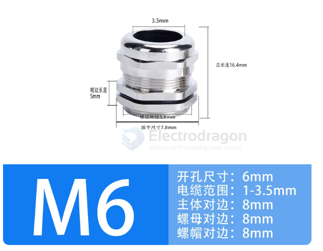
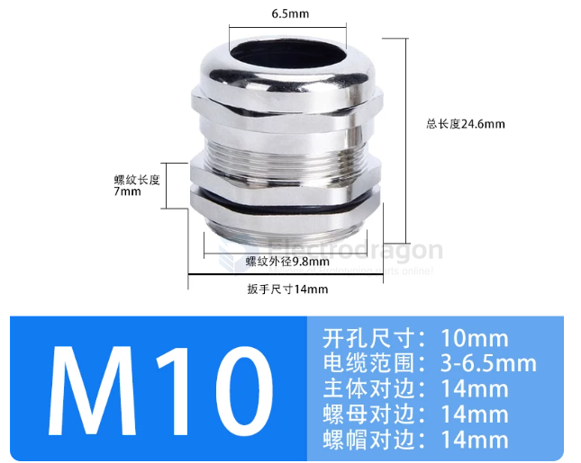
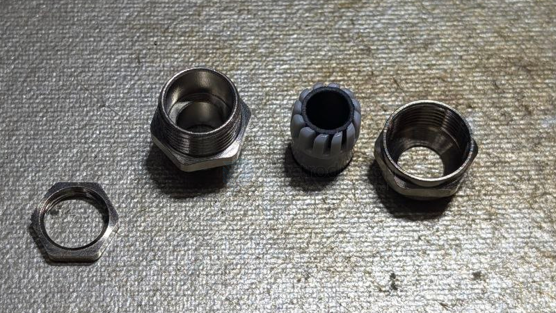
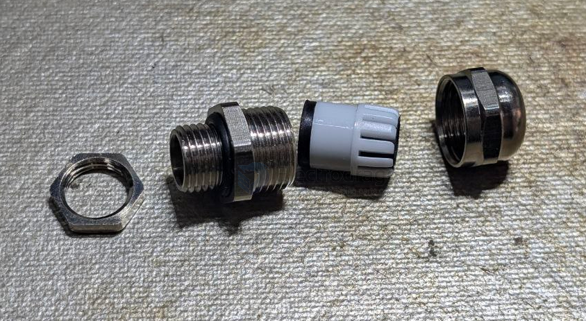
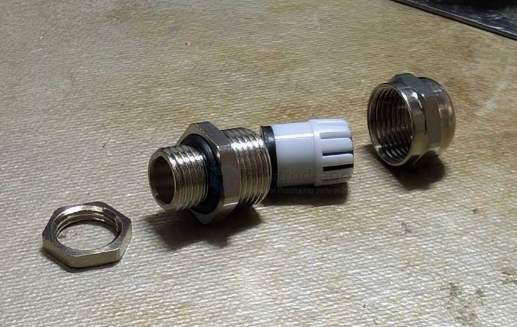
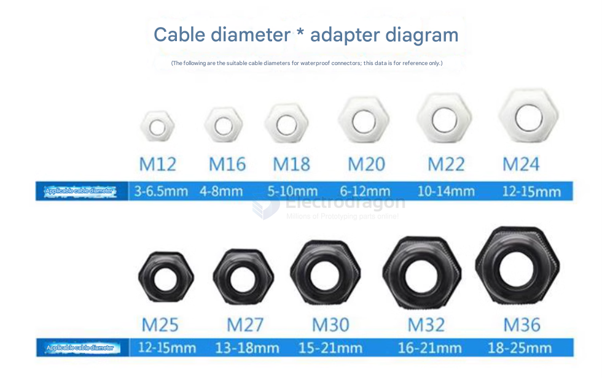

# CONN-waterproof-dat

- [[case-waterproof-dat]] - [[CONN-waterproof-dat]]

## M6 

- 开孔尺寸：6mm
- 电缆范围：1-3.5mm
- 主体对边：8mm
- 螺母对边：8mm
- 螺帽对边：8mm

## 10 

- 开孔尺寸：10mm
- 电缆范围：3-6.5mm
- 主体对边：14mm
- 螺母对边：14mm
- 螺帽对边：14mm

## version -1 

- [[IP68-dat]]

## specs 

## ref 

- [[waterproof-dat]] - [[conn-dat]]

- [[CONN-waterproof]] - [[CONN]]

