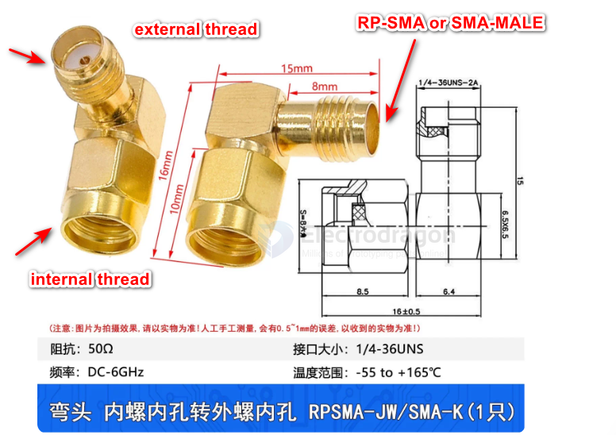
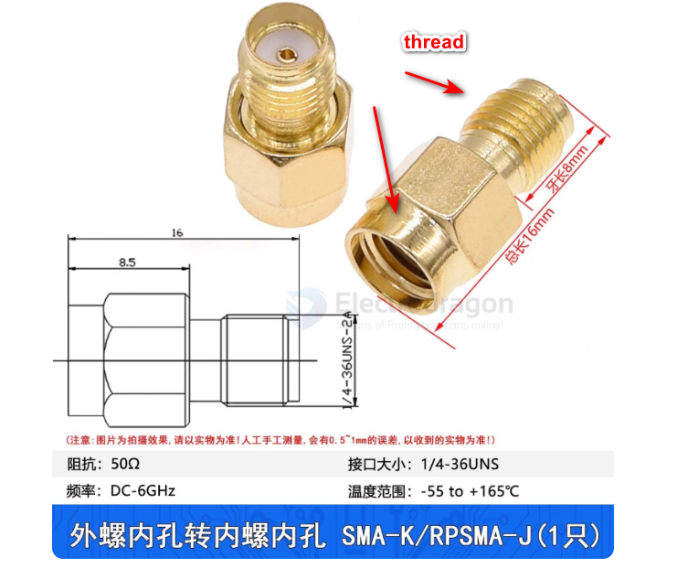
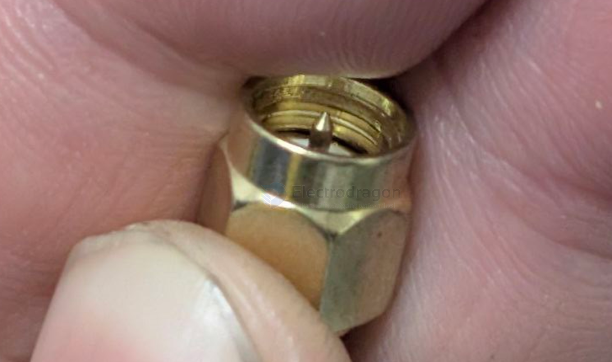
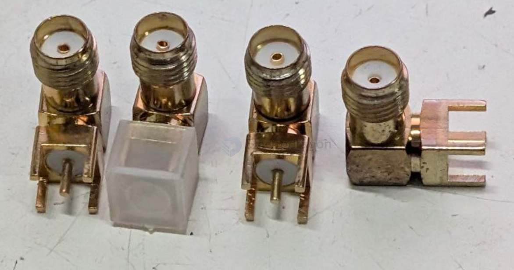
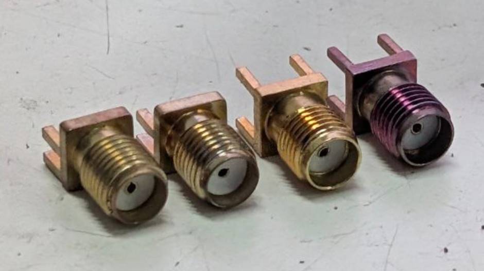

# conn-SMA-dat

- [[antenna-GNSS-dat]] - [[CONN-SMA-dat]] - [[CONN-IPEX-dat]]

- [[conn-antenna-dat]] - [[CONN-SMA-dat]]

- [[CONN-RP-SMA-dat]] - [[CONN-SMA-MALE-dat]] 

mmcx - [[CONN-MMCX-dat]]

## build 

- [[antenna-FPV-dat]] - [[VR03-dat]] - [[conn-SMA-dat]]

## info 

thread and angles

Connector SMA 

- more suitable to install on the plastic panel or wall by drilling a installation hole

## product 

- [[NAN1001-dat]]

## male pin == normally cable 

on the cable of [[NAN1001-dat]]

## female pin == normally PCB connector 

Vertical CONN 

Flat CONN

## ref 

- [[CONN-dat]]