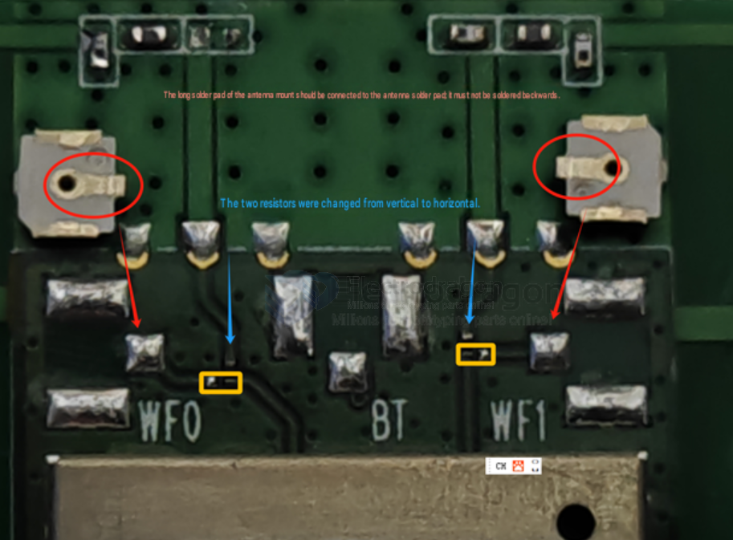

# conn-antenna-dat

- [[CONN-MMCX-dat]] - [[CONN-SMA-dat]] - [[CONN-antenna-dat]] - [[CONN-IPEX-dat]] - [[antenna-dat]] - [[conn-antenna-dat]] - [[conn-dat]]

## replace connector and switch connection by switching the resitors 

## ref 

