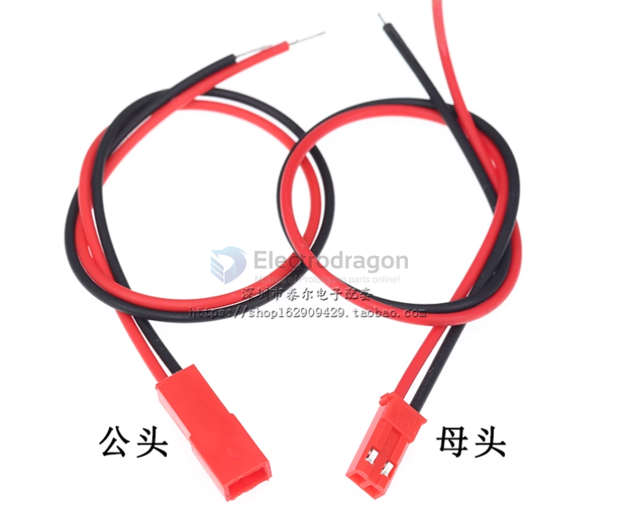

# CONN-cable-JST-dat

- [[CONN-cable-JST-dat]] - [[XH2.54-dat]] - [[PH2.0-dat]] - [[SM2.54-dat]]

- [[SH1.0-dat]] - [[GH1.25-dat]] - [[ZH1.5-dat]] - [[1.25-dat]] - [[HY2.0-dat]] - [[MX2.0-dat]]

- [[wire-to-wire-dat]]

types 

XHB2.54 connector, 2.54mm connector with buckle, straight pin, bent pin, socket, housing, plug, spring contacts, and terminals.

- [[XH2.54-dat]]

## info 

https://en.wikipedia.org/wiki/JST_connector

**JST** stands for **Japan Solderless Terminal**.  
It is a Japanese company that manufactures a wide variety of electrical connectors used in consumer electronics, automotive, industrial, and hobby applications.

## Key Points

- **Company**: JST Mfg. Co., Ltd. (founded 1957, Japan).  
- **Products**: Electrical connectors (board-to-wire, wire-to-wire, board-to-board, IDC, FFC/FPC, etc.).  
- **Famous series**:
  - **JST-XH** (2.50 mm pitch, board-to-wire)
  - **JST-PH** (2.00 mm pitch, board-to-wire, very common in LiPo battery packs)
  - **JST-SH** (1.00 mm pitch, used in drones and compact electronics)
  - **JST-SM** (2.50 mm pitch, wire-to-wire, common in LED strips)
- **Why popular**: Reliable, compact, standardized, and with secure locking features compared to generic “Dupont” connectors.

- [[JST-XH-dat]] - [[JST-PH-dat]] - [[JST-SM-dat]]

- [[PCA1032-dat]]

- also called RCY connector, BEC connector 

## male and female connector 

- [[PCA1032-dat]]

The **JST SM series** is a common wire-to-wire connector, often used in LED strips, RC electronics, and low-current applications.

## Key Specifications

- **Series**: JST SM  
- **Type**: Wire-to-wire, single row, housing + crimp terminal  
- **Pitch (pin spacing)**: **2.50 mm** (not 2.54 mm)  
- **Current rating**: ~3 A (per pin, typical)  
- **Voltage rating**: ~250 V AC/DC  
- **Number of positions**: 2–12 pins available  
- **Locking mechanism**: Positive latch (prevents accidental disconnect)  
- **Wire gauge**: AWG 22–28 (stranded wires, typical)  
- **Mating cycles**: ~30 times (not a high-durability connector)  

## Important Note

- Many vendors (especially on marketplaces) mislabel it as **“2.54 mm”**, but **the official JST specification is 2.50 mm pitch**.  
- Since 2.50 mm ≈ 2.54 mm, people often confuse them, but they are **not guaranteed cross-compatible** with other 2.54 mm systems (like Dupont, KK254).

## Summary

- **Correct spec**: **JST SM 2.50 mm pitch**  
- “JST SM 2.54” is just a common mislabeling.

## 2.54mm, 2.0mm

## ref 

- [[CONN-cable-JST-dat]]