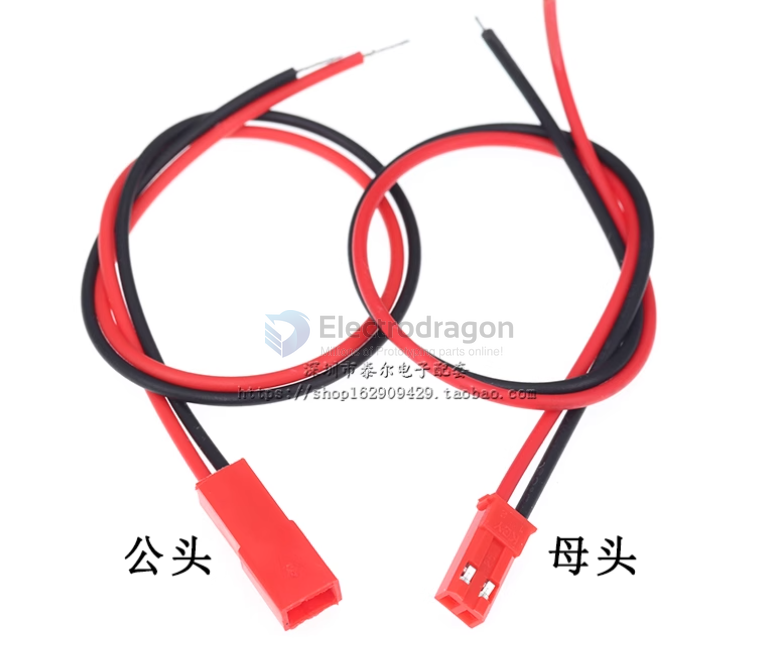

# JST-dat

types 

XHB2.54 connector, 2.54mm connector with buckle, straight pin, bent pin, socket, housing, plug, spring contacts, and terminals.

- [[XH2.54-dat]]

## info 

https://en.wikipedia.org/wiki/JST_connector

**JST** stands for **Japan Solderless Terminal**.  
It is a Japanese company that manufactures a wide variety of electrical connectors used in consumer electronics, automotive, industrial, and hobby applications.

## Key Points

- **Company**: JST Mfg. Co., Ltd. (founded 1957, Japan).  
- **Products**: Electrical connectors (board-to-wire, wire-to-wire, board-to-board, IDC, FFC/FPC, etc.).  
- **Famous series**:
  - **JST-XH** (2.50 mm pitch, board-to-wire)
  - **JST-PH** (2.00 mm pitch, board-to-wire, very common in LiPo battery packs)
  - **JST-SH** (1.00 mm pitch, used in drones and compact electronics)
  - **JST-SM** (2.50 mm pitch, wire-to-wire, common in LED strips)
- **Why popular**: Reliable, compact, standardized, and with secure locking features compared to generic “Dupont” connectors.

- [[JST-XH-dat]] - [[JST-PH-dat]] - [[JST-SM-dat]]

- [[PCA1032-dat]]

- also called RCY connector, BEC connector 

## male and female connector 

## 2.54mm, 2.0mm

