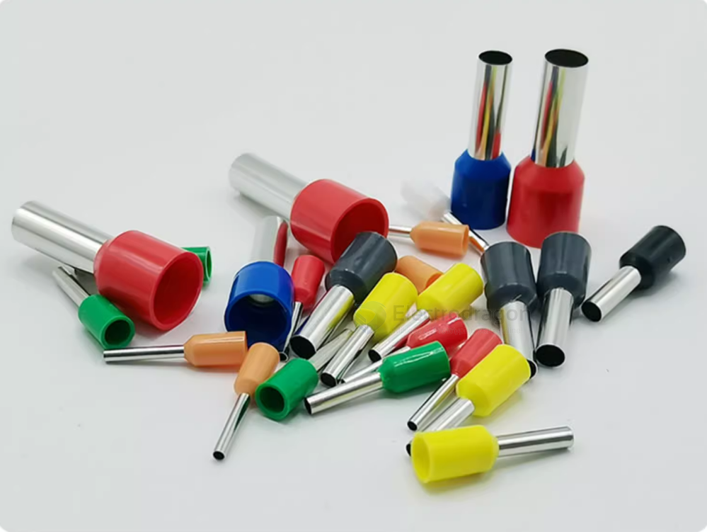
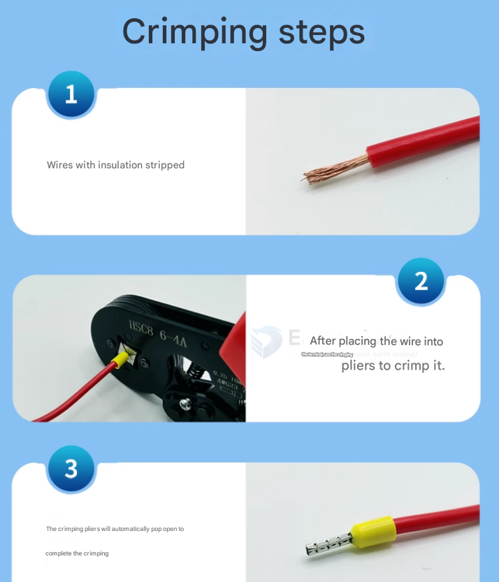
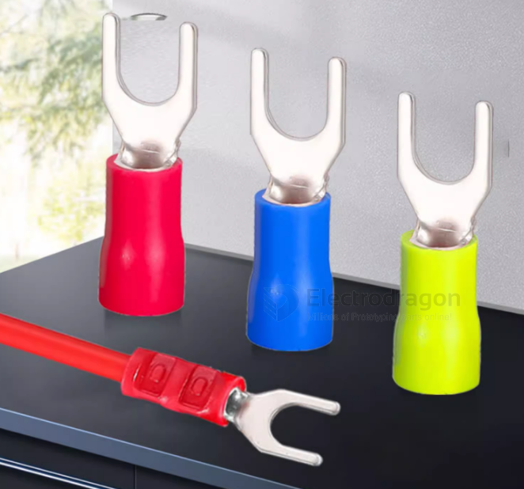
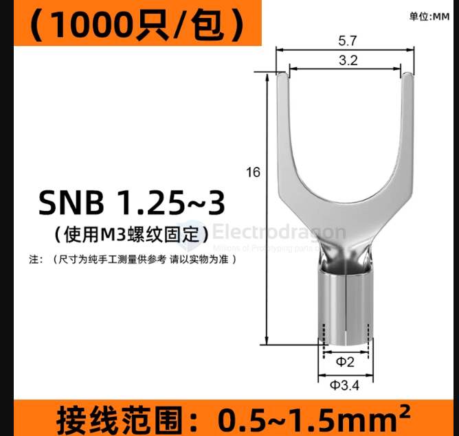
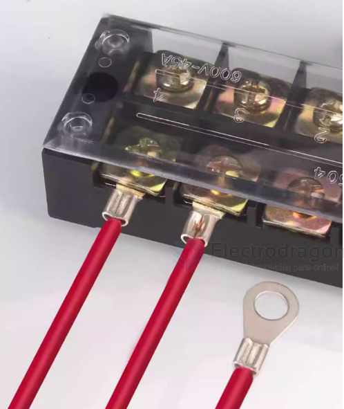

# CONN-terminal-crimp-dat

## VE-type tubular crimp terminal

VE-type tubular crimp terminals are designed for use with stranded wire and are typically used in applications where a secure and reliable electrical connection is required. They are commonly used in automotive, industrial, and electronic applications.

## SNB U-shape Fork-type insulated crimp terminal

## OT-type ring terminal

## ref 

- [[conn-dat]]