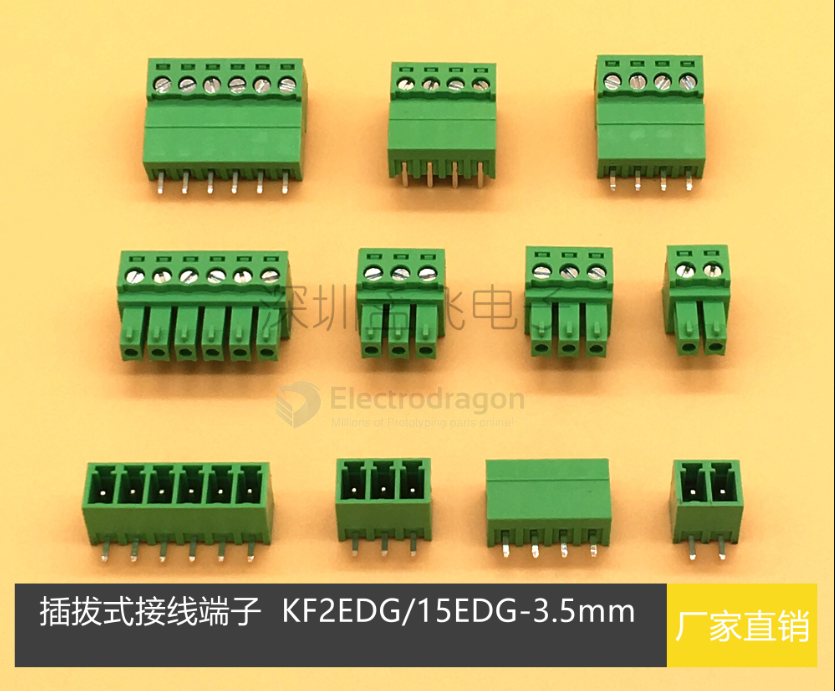

# KF2EDG-dat

- [[conn-cable-terminal-dat]] - [[pitch-dat]] - [[CONN-dat]]

## pitch 5.08 

## pitch 3.81 

| Model                                | Description                   | Pins  |
| :----------------------------------- | :---------------------------- | :---- |
| **Plugs (Female)**                   |                               |       |
| KF2EDG K-3.81-2P                     | Plug                          | 2P    |
| KF2EDG K-3.81-3P                     | Plug                          | 3P    |
| KF2EDG K-3.81-4P                     | Plug                          | 4P    |
| KF2EDG K-3.81-5P                     | Plug                          | 5P    |
| KF2EDG K-3.81-6P                     | Plug                          | 6P    |
| KF2EDG K-3.81-7P                     | Plug                          | 7P    |
| KF2EDG K-3.81-8P                     | Plug                          | 8P    |
| KF2EDG K-3.81-9P                     | Plug                          | 9P    |
| KF2EDG K-3.81-10P                    | Plug                          | 10P   |
| KF2EDG K-3.81-12P                    | Plug                          | 12P   |
| **Vertical Plugs**                   |                               |       |
| KF2EDG KA-3.81-2P                    | Vertical Plug (Type A)        | 2P    |
| KF2EDG KA-3.81-3P                    | Vertical Plug (Type A)        | 3P    |
| KF2EDG KA-3.81-4P                    | Vertical Plug (Type A)        | 4P    |
| KF2EDG KA-3.81-5P                    | Vertical Plug (Type A)        | 5P    |
| KF2EDG KA-3.81-6P                    | Vertical Plug (Type A)        | 6P    |
| KF2EDG KA-3.81-8P                    | Vertical Plug (Type A)        | 8P    |
| KF2EDG KB-3.81-2P                    | Vertical Plug (Type B)        | 2P    |
| KF2EDG KB-3.81-3P                    | Vertical Plug (Type B)        | 3P    |
| KF2EDG KB-3.81-4P                    | Vertical Plug (Type B)        | 4P    |
| KF2EDG KB-3.81-5P                    | Vertical Plug (Type B)        | 5P    |
| KF2EDG KB-3.81-6P                    | Vertical Plug (Type B)        | 6P    |
| KF2EDG KB-3.81-8P                    | Vertical Plug (Type B)        | 8P    |
| **Spring-Loaded Plugs**              |                               |       |
| KF2EDG KD-3.81-2P                    | Spring-Type Plug              | 2P    |
| KF2EDG KD-3.81-3P                    | Spring-Type Plug              | 3P    |
| KF2EDG KD-3.81-4P                    | Spring-Type Plug              | 4P    |
| KF2EDG KD-3.81-5P                    | Spring-Type Plug              | 5P    |
| KF2EDG KD-3.81-6P                    | Spring-Type Plug              | 6P    |
| KF2EDG KD-3.81-8P                    | Spring-Type Plug              | 8P    |
| **Straight Headers (Vertical)**      |                               |       |
| KF2EDG V-3.81-2P                     | Straight Pin Header           | 2P    |
| KF2EDG V-3.81-3P                     | Straight Pin Header           | 3P    |
| KF2EDG V-3.81-4P                     | Straight Pin Header           | 4P    |
| KF2EDG V-3.81-5P                     | Straight Pin Header           | 5P    |
| KF2EDG V-3.81-6P                     | Straight Pin Header           | 6P    |
| KF2EDG V-3.81-7P                     | Straight Pin Header           | 7P    |
| KF2EDG V-3.81-8P                     | Straight Pin Header           | 8P    |
| KF2EDG V-3.81-9P                     | Straight Pin Header           | 9P    |
| KF2EDG V-3.81-10P                    | Straight Pin Header           | 10P   |
| KF2EDG V-3.81-12P                    | Straight Pin Header           | 12P   |
| **Right Angle Headers (Horizontal)** |                               |       |
| KF2EDG R-3.81-2P                     | Right Angle Pin Header        | 2P    |
| KF2EDG R-3.81-3P                     | Right Angle Pin Header        | 3P    |
| KF2EDG R-3.81-4P                     | Right Angle Pin Header        | 4P    |
| KF2EDG R-3.81-5P                     | Right Angle Pin Header        | 5P    |
| KF2EDG R-3.81-6P                     | Right Angle Pin Header        | 6P    |
| KF2EDG R-3.81-7P                     | Right Angle Pin Header        | 7P    |
| KF2EDG R-3.81-8P                     | Right Angle Pin Header        | 8P    |
| KF2EDG R-3.81-9P                     | Right Angle Pin Header        | 9P    |
| KF2EDG R-3.81-10P                    | Right Angle Pin Header        | 10P   |
| KF2EDG R-3.81-12P                    | Right Angle Pin Header        | 12P   |
| **Double Row Headers**               |                               |       |
| KF2EDG RH-3.81-2*2P                  | Double Row Right Angle Header | 2*2P  |
| KF2EDG RH-3.81-2*3P                  | Double Row Right Angle Header | 2*3P  |
| KF2EDG RH-3.81-2*4P                  | Double Row Right Angle Header | 2*4P  |
| KF2EDG RH-3.81-2*5P                  | Double Row Right Angle Header | 2*5P  |
| KF2EDG RH-3.81-2*6P                  | Double Row Right Angle Header | 2*6P  |
| KF2EDG RH-3.81-2*7P                  | Double Row Right Angle Header | 2*7P  |
| KF2EDG RH-3.81-2*8P                  | Double Row Right Angle Header | 2*8P  |
| KF2EDG RH-3.81-2*9P                  | Double Row Right Angle Header | 2*9P  |
| KF2EDG RH-3.81-2*10P                 | Double Row Right Angle Header | 2*10P |

KF2EDG-3.5mm 

## 3.81 pitch 

KF-EDG-3.81mm 

## 3.96mm pitch

- [[HT396R]] - [[KF2EDG]]
