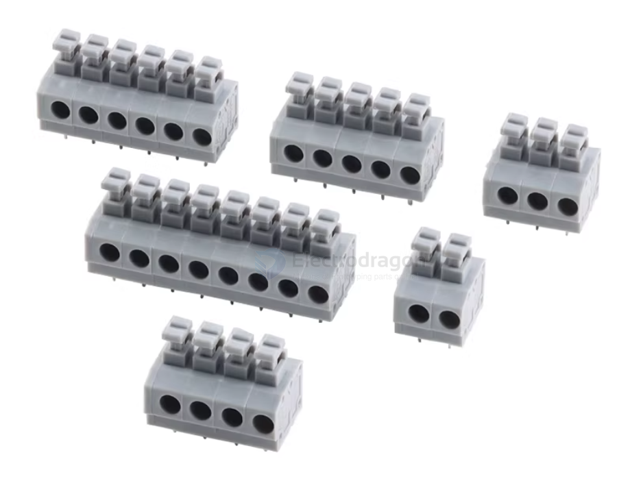
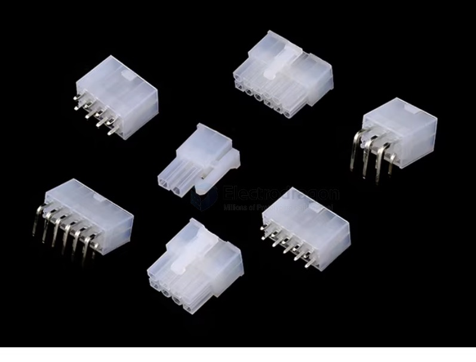
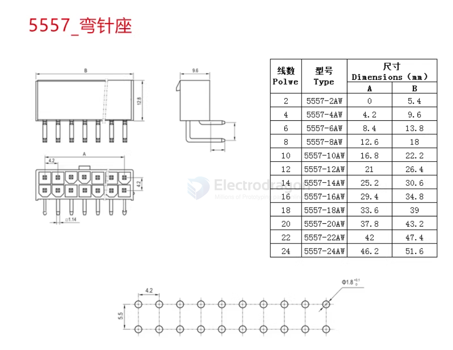
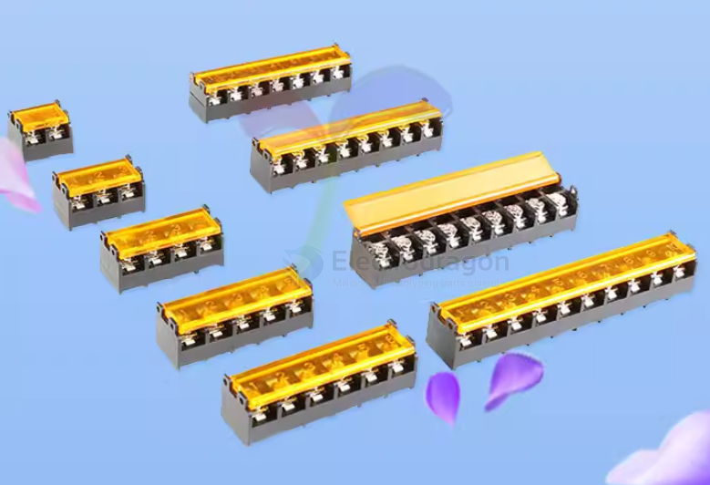
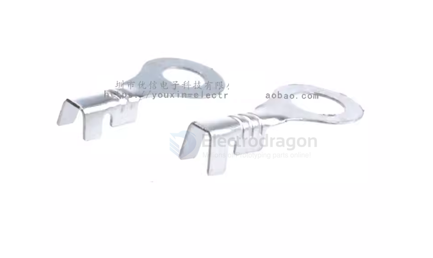
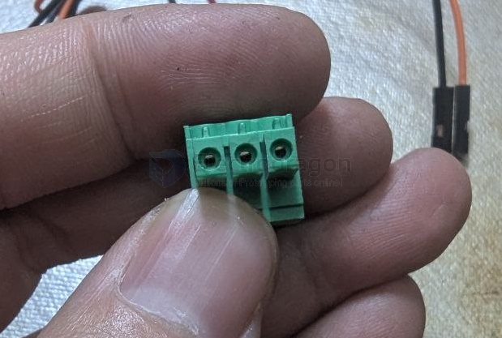

# conn-cable-terminal-dat

- [[JST-dat]] - [[XH2.54-dat]]

- [[conn-box-header-dat]] - [[CONN-dat]]

## 3.5mm pitch 

- [[KF2EDG-dat]]
  
- [[KF350-dat]]

- [[KF15EDG-dat]] - 两边需要预留间隙

## 5.0mm pitch 

- [[dg202-dat]]

- [[kf126-dat]]
- [[kf128-dat]]

HT508 V/R/K - 5.08mm pitch pluggable terminal connector, straight pin/bent pin socket/plug

### KF235-5.0

KF235-5.0-2/3/4/5/6/8P/直插

250V/10A 5.0mm 间距弹簧式PCB接线端子

KF127/A-5.0/5.08mm pitch screw-type PCB terminal connector, single-row or double-row, splicable.

KF129-5.0/5.08mm间距螺钉式PCB接线端子连接器2P/3P可拼接

KF128 

KF126 

## uncommon to usd 

## 0.8 mm ~ 1.00 mm ~ 1.25 mm ~ 2.0 mm 

GH1.25 Patch Panel Connector with 1.25mm Pitch, featuring a buckle and locking mechanism, and includes a vertical/horizontal socket housing and plug.

SH1.0mm 2/3/4/5/6/7/8/9/10P Single/Double End Electronic Terminal Cable, 10CM Long Connecting Cable

## 3.96 mm 

VH3.96 connector, 3.96mm pitch connector, straight pin, bent pin, socket, housing, plug, spring contacts, terminals.

VH housing, plug, 3.96mm pitch, connector 2P/3/4/5/6/7/8/9/10/12P (10 pieces)

## 4.2 mm pitch 

5557-4.2mm pitch series connectors: straight pin headers/bent pin headers/male housings/terminal springs

## 7.62 mm 

MG/DG/KF762 Terminal Block 2P 3P 4P Power Supply Junction Box, Spacing 7.62MM, 300V 20A

## 8.5 mm ~ 9.5 mm 

HB-9500 2P/3P/4P/5P/6P/7P/8P/9P/10P with cover, 9.5MM barrier type terminal block

## Closed-End Terminals

CE-1X CE-2X Closed-End Terminals, Nipple/Tooth Wire Connectors, Quick-Connect Caps, Wire Caps

3.2mm and 4.2mm inner diameter terminal blocks, cold-pressed terminals, round nose terminals, bare terminals, connectors.

## use guide 

### check the holes first 

no thing block and then push again 

## ref 

- [[cable-terminal]]