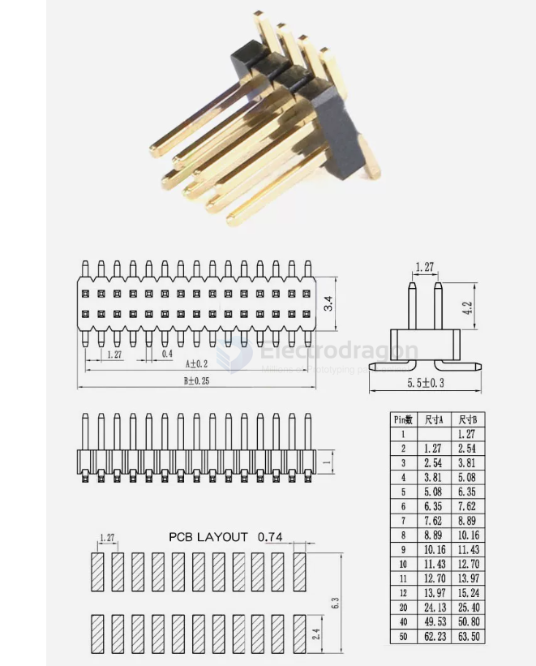
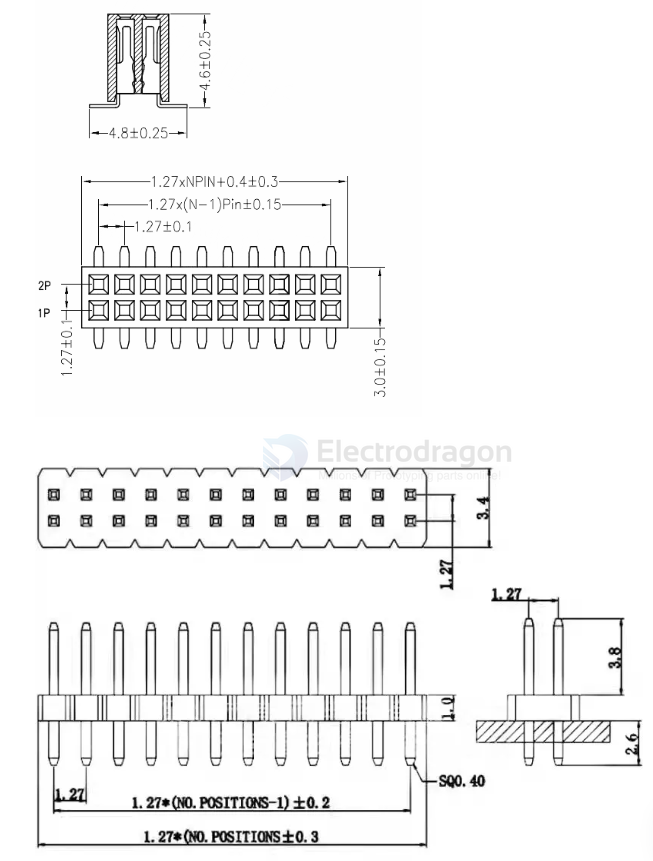

# CONN-pin-header-SMD-dat

- [[CONN-dat]] - [[pitch-dat]] - [[conn-pin-header-dat]] - [[conn-pin-header-female-dat]] - [[conn-pin-header-SMD-dat]]

pitch 1.27mm double rows 

- 2*3P
- 2*4P
- 2*5P
- 2*6P
- 2*7P
- 2*8P
- 2*10P
- 2*12P
- 2*13P
- 2*15P
- 2*20P
- 2*25P
- 2*30P
- 2*40P
- 2*50P

- 贴针
- 贴母
- 直针
- 直母

## ref 