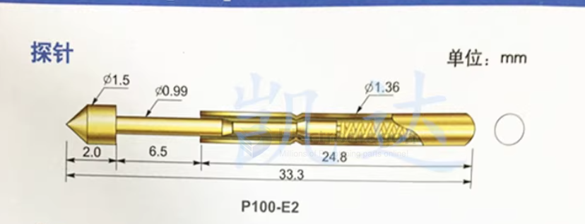
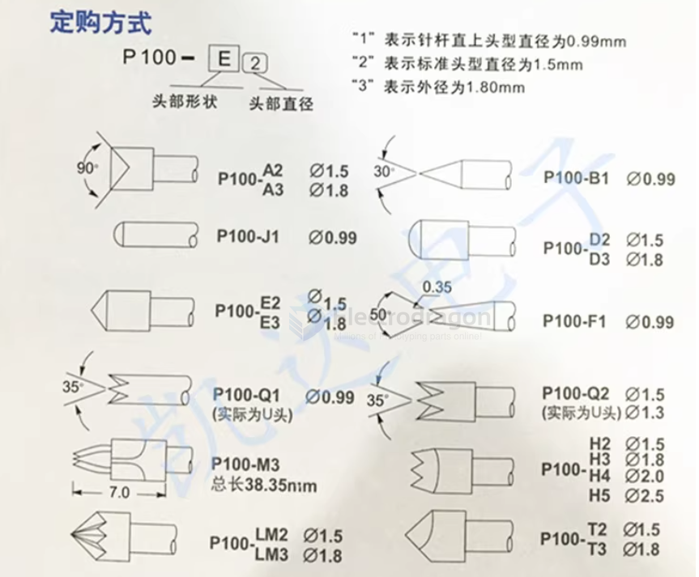
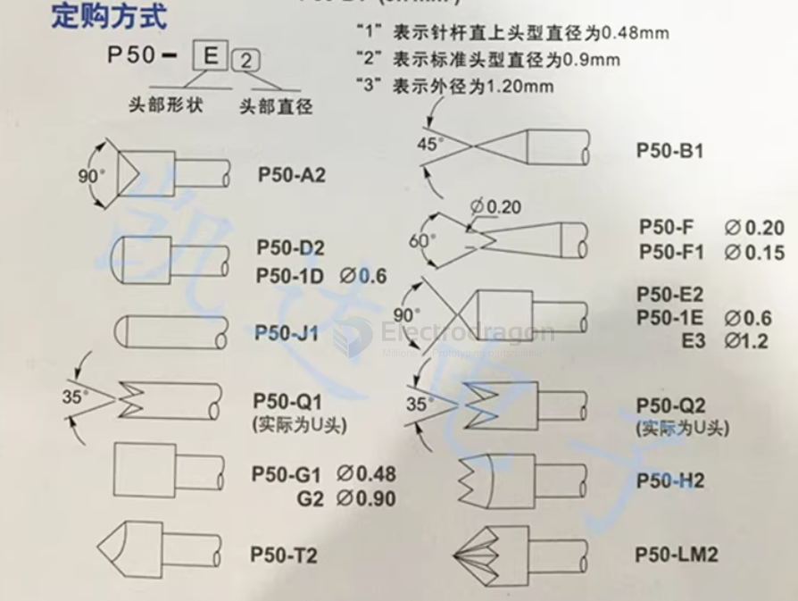
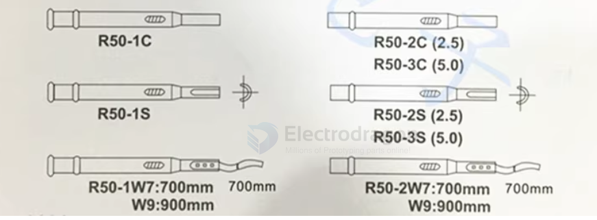

# pogo-pin-dat

## TH178 

- solder pin 0.7 ~ 0.8 
- test target pin 0.8~0.9

## 探针 test pin 

### P100 series 

- P100-E2
- P100-E3
- P100-D2 
- P100-H2 

### replacable head

### E2 E3 seres info 

- 针管直径：1.36mm;       
- 针杆直径：0.99mm;
- E2针头直径：1.5mm;         
- 探针总长：33.3mm;
- E3针头直径：1.8mm;
- 针套另购，针套直径1.67mm;
- 针套钻孔尺寸：1.7mm;
- 额定电流：3安培;     
- 接触电阻：50毫欧姆;
- 最小测试间距：2.54mm。

### P50 series 

### P50 series holder 

through-hole == 0.7 ~ 0.8 mm

## demo video 

- [a lot pins test](https://x.com/electro_phoenix/status/1874755441533894696)

## ref

- [[pogo-pin]]