# pogo-pin-dat

- [[fab-ICT-dat]] - [[fab-QC-dat]]

## TH178 

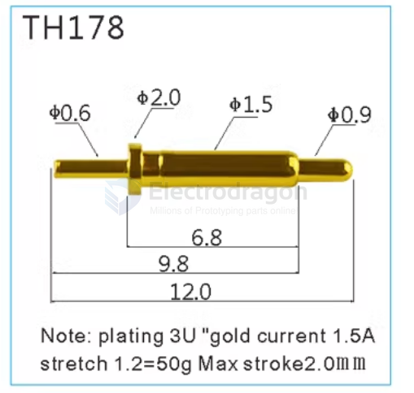

- solder pin 0.7 ~ 0.8 
- test target pin 0.8~0.9

## 探针 test pin 

### P100 series 

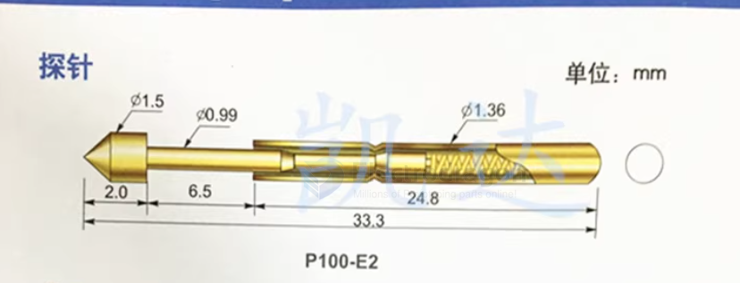

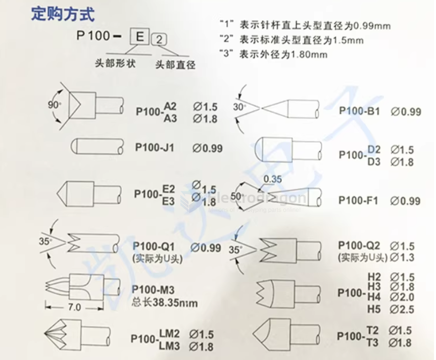

- P100-E2
- P100-E3
- P100-D2 
- P100-H2 

### replacable head

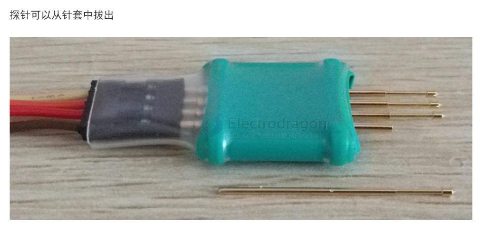

### E2 E3 seres info 

- 针管直径：1.36mm;       
- 针杆直径：0.99mm;
- E2针头直径：1.5mm;         
- 探针总长：33.3mm;
- E3针头直径：1.8mm;
- 针套另购，针套直径1.67mm;
- 针套钻孔尺寸：1.7mm;
- 额定电流：3安培;     
- 接触电阻：50毫欧姆;
- 最小测试间距：2.54mm。

### P50 series 

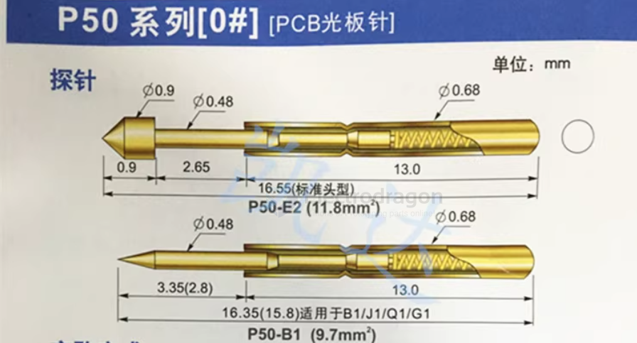

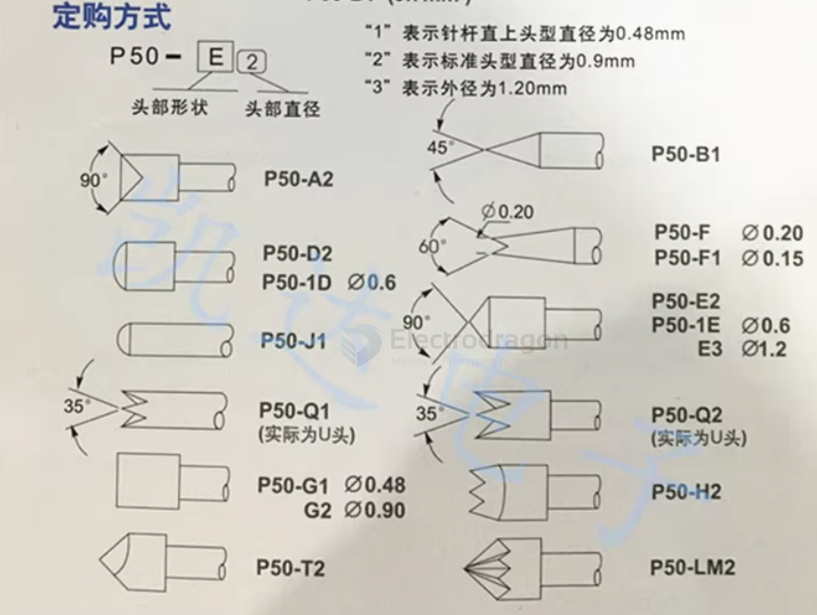

### P50 series holder 

through-hole == 0.7 ~ 0.8 mm

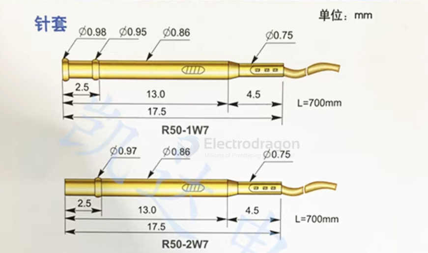

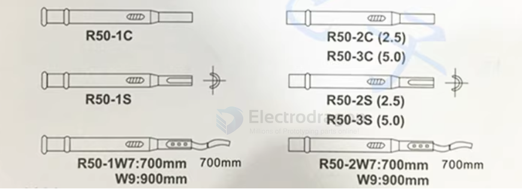

## battery pogo style connector 

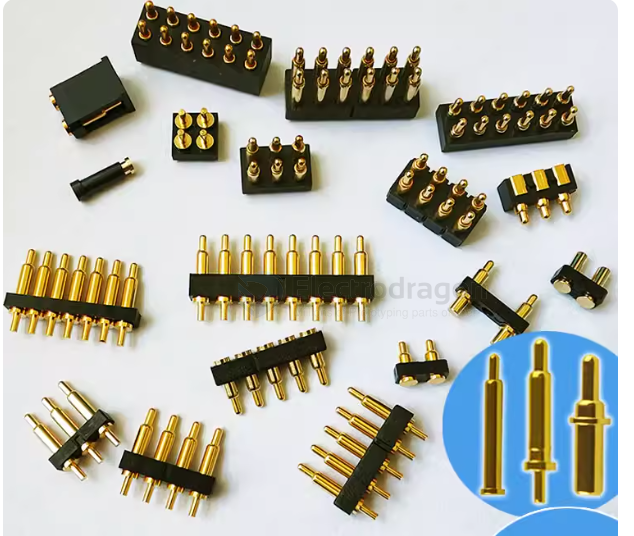

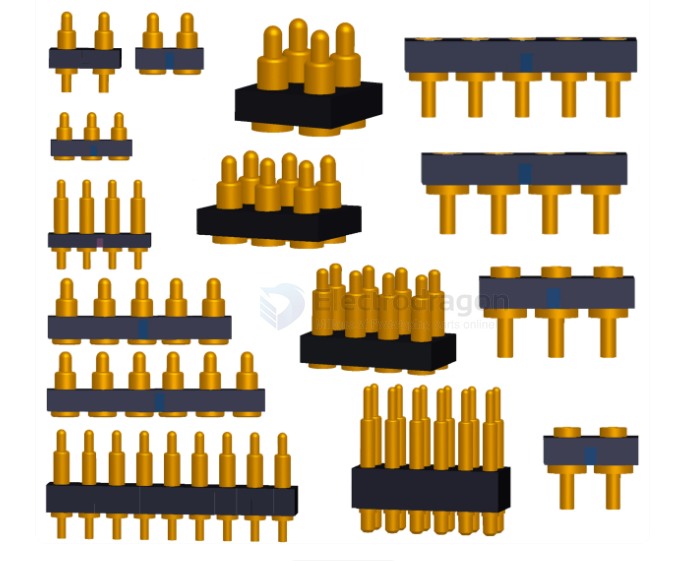

- TH184-2pin（间距可以备注）
- TH073-2pin
- TH162-2PIN
- 塑胶不带针
- 2*6.0-3pin
- TH176-4pin
- TH176-5pin
- 2*8.0-6pin
- 2*5.0-6pin双排
- 2*8.0-7pin
- TH178 -8pin
- 2*9.0-8pin双排
- TH176-9pin
- TH176-10pin双排
- TH194 -12pin双排
- P070-2pin母头
- H1533-1-3pin
- H1533-1-4pin
- 其它款订制母头
- TH050 2pin 3PH
- TH176-双排14PIN
- 4PIN 弯针母头P128
- 4P4.0PH
- TH302

## male and female types - commonly used for charging 

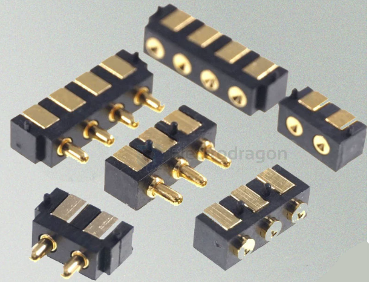

## demo video 

- [a lot pins test](https://x.com/electro_phoenix/status/1874755441533894696)

## design guide 

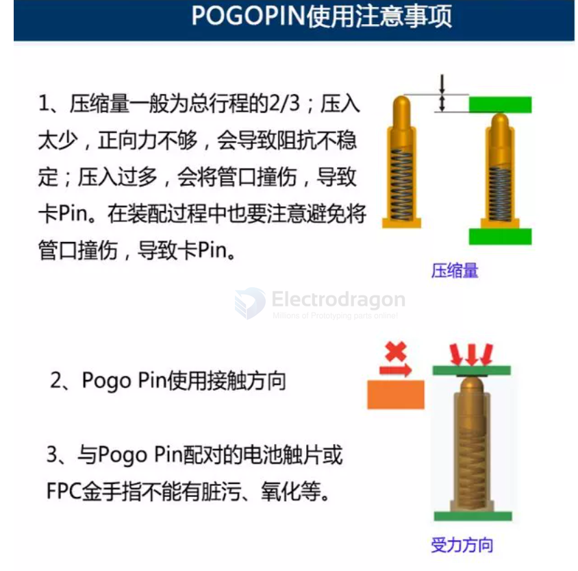

1、压缩量一般为总行程的2/3；压入太少，正向力不够，会导致阻抗不稳定；压入过多，会将管口撞伤，导致卡Pin。在装配过程中也要注意避免将管口撞伤，导致卡Pin。
2、PogoPin使用接触方向
3、与Pogo Pin配对的电池触片或FPC金手指不能有脏污、氧化等。

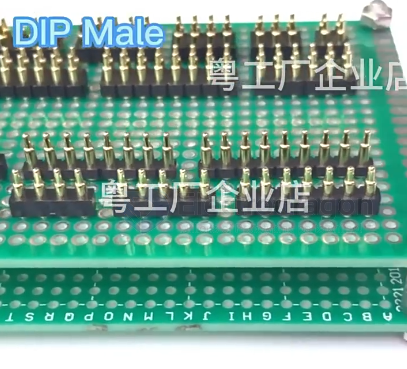

## apps 

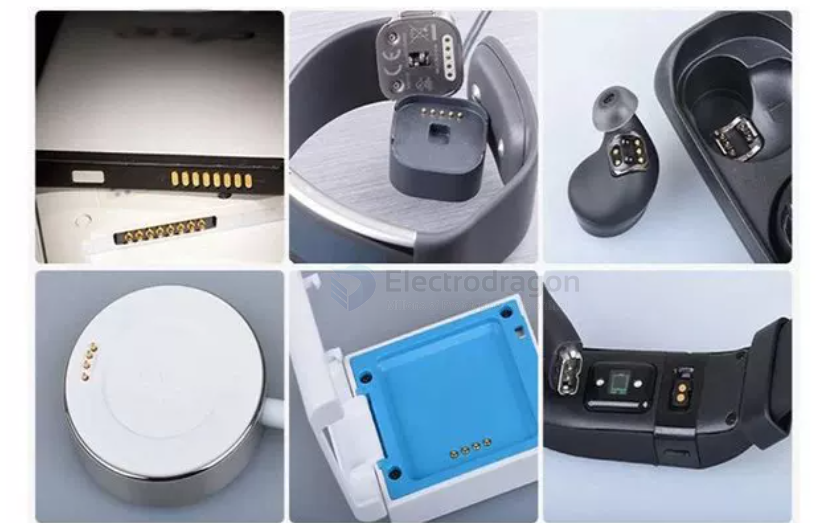

- 1、共享系列：共享单车、共享雨伞、共享汽车
- 2、手持终类：手机、平板、POS机等
- 3、智能穿戴类：智能手表、智能家居、智能家电
- 4、其他：各类型智能机器人、无人机以及医疗器械

## ref

- [[pogo-pin]]