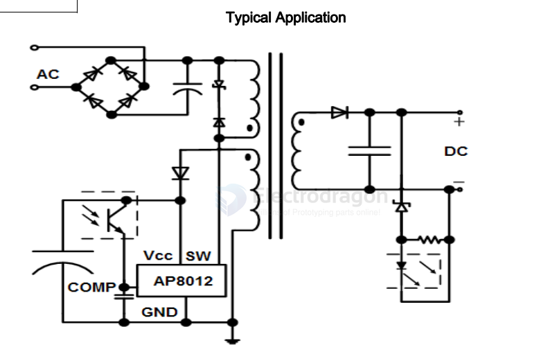

# AP8012-dat

- [[AP8012-dat]] - [[AIT-IC-dat]] - [[acdc-dat]] - [[OPM1110-dat]]

The AP8012 combines a dedicated current mode PWM controller with a high voltage power MOSFET on the same silicon chip.

Typical Power Capability:

Type SOP8 DIP8
- European (195-265 Vac) 8W 13W
- US (85-265 Vac) 5 W 8W

The AP8012 is available in SOP8 and DIP8 package.

## datasheet 

- [[AP8012-DS.pdf]]

## SCH 

## ref 

