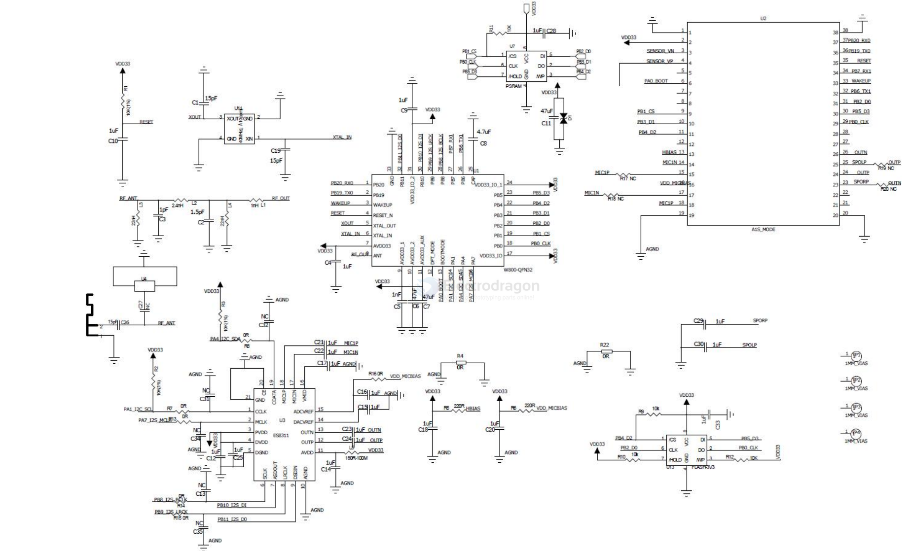

# AI-WB1-dat

- [[AI-WB1-dat]] - [[AIT-dat]] - [[ES8311-dat]] - [[W800-dat]] - [[W600-DAT]] - [[bouffalolab-dat]]

Ai-WB1系列 == `Ai-WB1-A1S`

Ai-WB1 系列模组是深圳市安信可科技有限公司开发的 Wi-Fi + BlueTooth 模组，基于联盛德 W800 芯片，支持 Wi-Fi 802.11b/g/n 和 BLE 4.2，适用于智能家居等物联网设备。

W800 芯片内置 32 位 XT804 CPU（240MHz）、2MB Flash、288KB RAM，配备 SDIO、PSRAM、SPI、UART 等接口，可应用于物联网、移动设备等领域。

2.固件 烧录

烧录工具下载地址：https://docs.ai-thinker.com/ai_wb1

在转接板没上电之前，把BOOT引脚接地后，转接板上电，然后持续打印cccc，表示模组进入烧录模式：

然后就可以选择固件进行，下载了，固件下载地址：https://docs.ai-thinker.com/ai_wb1

## log 

    Welcome boot2.0!
    build: Jul 19 2021 15:53:39
    Use develop key to verify...
    load img & jump to [prim]
    load&jump 0x8012000,0x8012000,1689768
    all copy over..j m
    j 0x08012014
    internalflsID:85
    [   0.021]<I>[uni_auto_ctrl]  user_gpio_init success
    [   0.031]<I>KWS kws version is :7.4.0
    [   0.035]<W>VCPROC samples_per_frame=256
    [   0.039]<I>sampling samples_per_frame=1024
    [   0.043]<I>sampling freq=16000, bits=16, frame_size=2048, buf_size=4096
    [   0.050]<D>us615_codec period=2048, fifo_size=4096
    [   0.055]<E>us615_codec es8311_reinit, 278 fail
    [   0.059]<E>us615_codec es8311 config failed
    [   0.063]<D>sampling sample open success, bit width 16, sample rate 16000
    [   0.070]<D>sampling codec sampling start success
    [   0.075]<I>VCPROC frame_size=512
    [   0.078]<I>INIT A1S Build:Feb  3 2023,10:49:14
    [   0.083]<I>INIT find 5 partitions
    [   0.095]<D>bt_hci_h4 bt_us615_register
    [   0.099]<D>bt_hci_h4 h4_hal_init
    Welcome to CLI...
    > [   0.106]<D>APP 1.0.0

    [   0.109]<D>APP_SYS boot reason 0
    [   0.112]<D>us615_codec start es8311 config
    [   0.173]<D>us615_codec end es8311 config
    [   0.177]<D>app_fota 1.0.0
    [   0.190]<I>APP wifi in mode 0
    [   0.193]<D>user_player play 107 file, addr=81a23a4, len=1954
    [   0.199]<D>VCPROC ai mute [0]
    [   0.202]<D>KWS kws stop
    [   0.205]<D>KWS kws is not running, skip stop
    TTS START
    [   0.210]<D>LAUDIO play start lock
    [   0.213]<D>LAUDIO play start locked
    [   0.266]<D>LAUDIO codec output configed
    [   0.269]<D>LAUDIO codec output started
    [   0.274]<D>LAUDIO inter started
    [   2.086]<D>user_player next num is -1
    [   2.090]<D>user_player feed data end
    [   2.161]<D>LAUDIO play stop unlock
    [   2.164]<D>LAUDIO play stop unlocked
    TTS END
    [   2.168]<D>VCPROC ai unmute [1]
    [   2.171]<D>us615_codec period=2048, fifo_size=4096
    [   2.176]<D>us615_codec skip config same sr:16000
    [   2.181]<D>sampling sample open success, bit width 16, sample rate 16000
    [   2.188]<D>sampling codec sampling start success
    [   2.192]<D>KWS kws relaunch
    [   2.195]<D>KWS kws relaunch lock
    [   2.198]<D>KWS kws relaunch locked
    enter wakeup_normal
    [   2.223]<I>KWS kws start in 0 mode
    [   2.226]<D>KWS kws relaunch done
    [   7.850]<D>lasr_parse command=浣犲ソ灏忓畨, score=-15.56
    [   7.856]<I>KWS command=浣犲ソ灏忓畨, score=-15.56, std_thresh=0.60
    offline_result:[wakeup_normal]	command[浣犲ソ灏忓畨]	score[-15.56]	
    [  14.314]<D>lasr_parse command=浣犲ソ灏忓畨, score=-6.84
    [  14.319]<I>KWS command=浣犲ソ灏忓畨, score=-6.84, std_thresh=0.60
    offline_result:[wakeup_normal]	command[浣犲ソ灏忓畨]	score[-6.84]	
    [  16.236]<D>lasr_parse command=浣犲ソ灏忓畨, score=-14.50
    [  16.241]<I>KWS command=浣犲ソ灏忓畨, score=-14.50, std_thresh=0.60
    offline_result:[wakeup_normal]	command[浣犲ソ灏忓畨]	score[-14.50]	
    RTF = 13950 (ms) / 16000 (ms) = 0.8719x
    [  27.049]<D>lasr_parse command=灏忓畨鍚屽, score=-12.75
    [  27.055]<I>KWS command=灏忓畨鍚屽, score=-12.75, std_thresh=0.60
    offline_result:[wakeup_normal]	command[灏忓畨鍚屽]	score[-12.75]	

## SCH

PB0~5 = [[flash-dat]]

PA1 PA4 == [[I2-dat]]

PB8 PB9 PB10 PB11 PA7 == [[I2S-dat]]

PB19 PB20 == [[UART-dat]]

PA0 == BOOT 

- [[W800-dat]] - [[ES8311-dat]] - [[codec-audio-dat]]

## ref 

