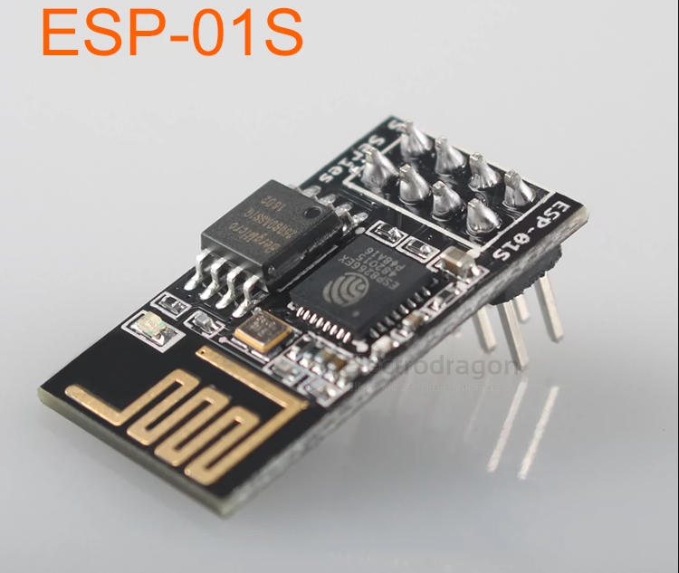

# ESP-01S-dat 

- [[NWI1070-dat]] - [[NWI1077-dat]]

https://www.electrodragon.com/product/esp-01-esp8266-wifi-module/

## Pin Definitions 

also printed on board 

- 3.3V RX
- RST IO0
- EN IO2
- TX GND 

### ESP-01S

the differences between ESP-01 VS ESP-01S (more components )

## ESP-01 VS ESP-01S

ESP-01S SCH

- IO15 - pull-down 
- reset - pull up
- chip_EN - pull up
- GPIO0 - pull up
- GPIO2 - LED + pull up

## special programmer 

- [[NWI1070-dat]]

## ref 

- [[ESP8266-DAT]]