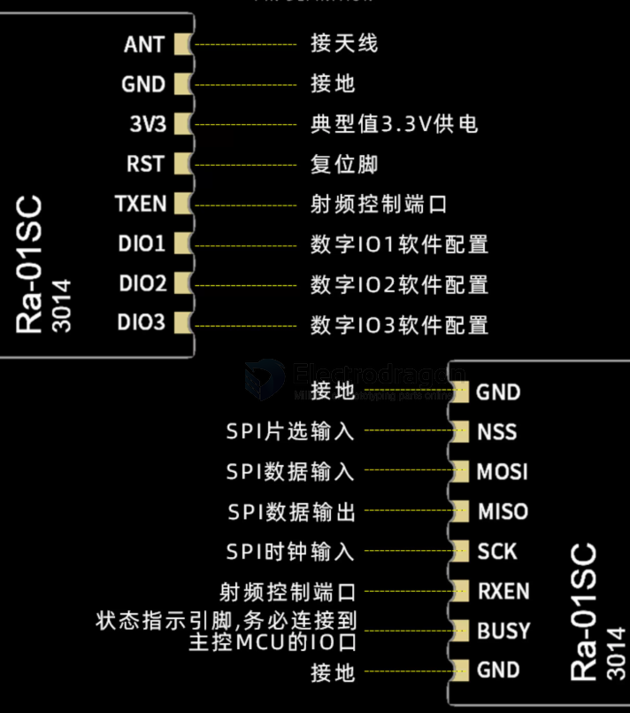
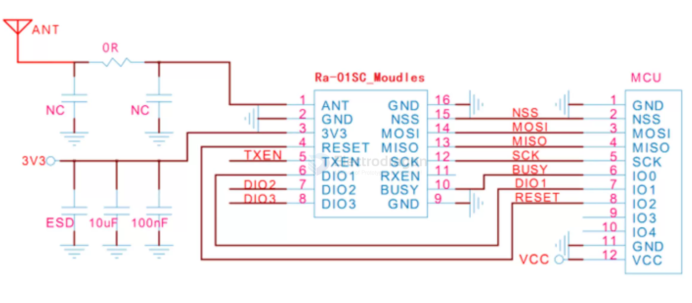

# RA-01SC-dat

Ra-01/02转Ra-01SC模组切换指导

- 1）MCU与模组连接增加BUSY引脚连接，对应Ra-01/Ra-02(DIO4);
- 2）MCU驱动更新，即SX1278芯驱动更换成LLCC68芯片驱动；
- 3）MCU更新LLCC68RF参数，调整到限定工作带宽、扩频因子。

功能特点：基于LLCC68芯开发，LLCC68具有超过-129dBm的高灵敏度，+22dBm的功率输出，传输距离远，可靠性。Ra-01SC模组主要于超长距离扩频通信，兼容FSK远程调制解调技术，解决了传统线设计案无法同时兼顾传输距离、抗扰性、功耗的问题。适于线抄表、楼宇动化、安防系统等场景。

- 模块型号 Ra-01SC
- 封装 SMD-16
- 尺寸(mm) 17*16*3.2(±0.2)mm
- 通讯接口 SPI
- 可编程比特率 最高可达300Kbps
- 频谱范围 410~525MHz
- 天线形式 兼容半孔/通孔焊盘（需焊接天线）/IPEX座子
- 最大发射功率 +22dBm
- 供电范围 2.7V~3.6V，典型值3.3V，电流大于200mA
- 工作温度 -40℃~85℃
- 存储环境 -40℃~125℃，<90%RH
- 传输距离 空旷场地搭配弹簧天线，实测2.8km
- 晶振频率 32MHZ

## dimension 

## ref 

