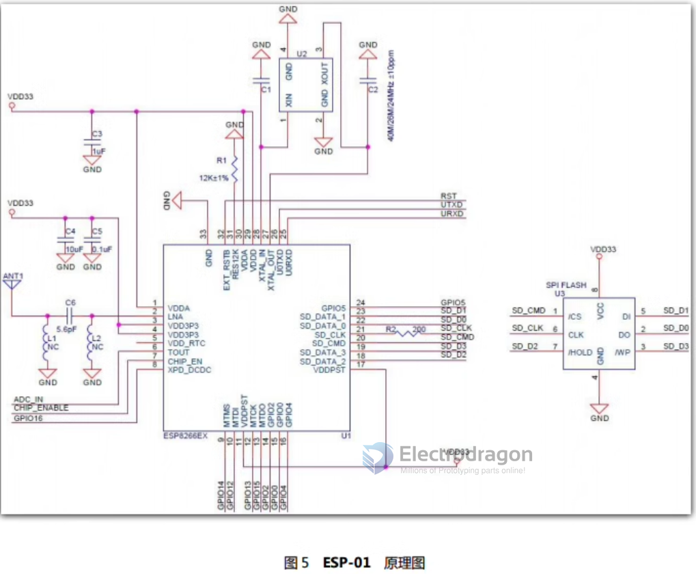

# ESP-01 DAT

- [[ESP8266-DAT]]

## hardware 

### ESP-01S

the differences between ESP-01 VS ESP-01S (more components )

### ESP-01 (obseleted, without suffix S)

1. GND - Ground
2. GPIO2 - General Purpose Input/Output
3. GPIO0 - General Purpose Input/Output (Used for boot mode too)
4. UXRXD - Receiver (for serial communication)
5. U0TXD - Transmitter (for serial communication)
6. CH_PD - Chip powerdown
7. EXT_RSTB - Reset
8. VCC - 3.3v input voltage

| Pin left | Pin Funcs                                   | Pin Right | Pin Funcs            |
| -------- | ------------------------------------------- | --------- | -------------------- |
| UXRXD    | Receiver (Serial)                           | VCC       | 3.3v input voltage   |
| GPIO0    | General Purpose IO (Used for boot mode too) | EXT_RSTB  | Reset                |
| GPIO2    | General Purpose IO                          | CH_PD     | Chip powerdown       |
| GND      | Ground                                      | U0TXD     | Transmitter (Serial) |

- on board LED : The blue LED on the ESP-01 module is connected to GPIO2 (UART0_TXD)

## ESP-01 VS ESP-01S

ESP-01S SCH

- IO15 - pull-down 
- reset - pull up
- chip_EN - pull up
- GPIO0 - pull up
- GPIO2 - LED + pull up

ESP-01 SCH

## arduino uploading 
- debug set to serial1 or disable 
- crystal 40M 
- flash 26M 
- DOUT
- v2 
- buildin LED = 2 or else

## 乱码问题

## datasheet 

- [[esp-01-ds.pdf]]

