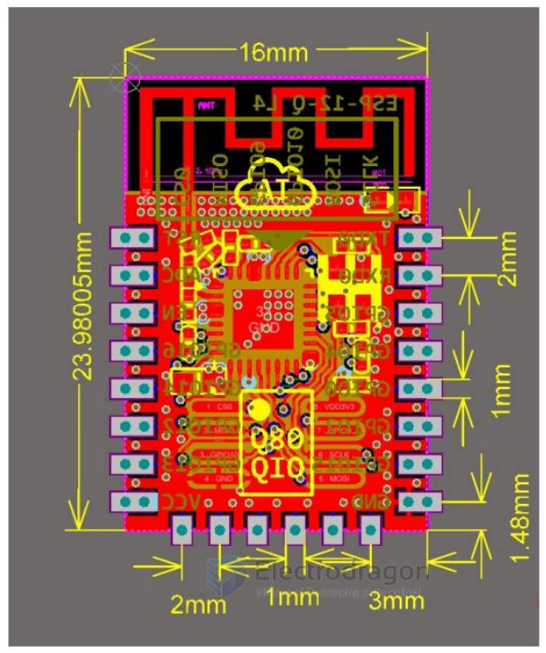

# ESP-12F-DAT

Dimension 

## ref 

- legacy chip wiki page here - https://w.electrodragon.com/w/Category:ESP8266
- legacy module page - https://w.electrodragon.com/w/ESP-12F_ESP8266_Wifi_Board

## Internal SCH

## Pin Definitions 

| left | --                         | right | --                 | func        |
| ---- | -------------------------- | ----- | ------------------ | ----------- |
| RST  | external pull-up, with cap | TXD   |                    |             |
| ADC  |                            | RXD   |                    |             |
| EN   | external pull-up           | IO5   |                    |             |
| IO16 |                            | IO4   |                    |             |
| IO14 |                            | IO0   | external pull-up   | mode select |
| IO12 |                            | IO2   | external pull-up   |             |
| IO13 |                            | IO15  | external pull-down |             |
| VCC  |                            | GND   |                    |             |

- on module LED IO2: low to on

## Periperhal design 

## datasheet 

- [[ESP-12F-DS.pdf]]
- [[ESP-12F-DS2-dat]]
- 
## ref 

- [[ESP8266-dat]]