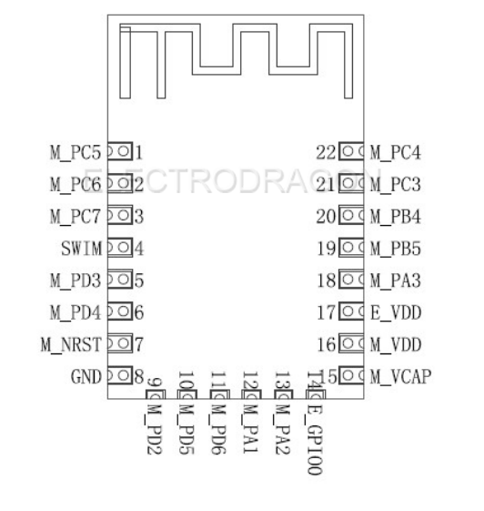

# ESP-14-dat 

## Pins 

* 1 M PC5 STM8 PC5 port
* 2 M_PC6 STM8 PC6 port
* 3 M_PC7 STM8 PC7 mouth
* 4 GND GND
* 5 M_PD3 STM8 PD3 port
* 6 M_PD4 STM8 PD4 port
* 7 M_NRST STM8 NRST port
* 8 GND common ground
* 9 M_PD2 STM8 PD2 port
* 10 M_PD5 STM8 PD5 port
* 11 M_PD6 STM8 PD6 port
* 12 M_PA1 STM8 PA1 port or crystal input port
* 13 M_PA2 STM8 PA2 port or oscillator output
* 14 E_GPIO0 ESP8266 GPIO0 port:  1) Default WiFi Status. 2) Operating mode selection.
* 15 M_VCAP STM8 VCAP port
* 16 M_VDD STM8 power supply pin
* 17 E_VDD ESP8266 power supply pin
* 18 M_PA3 STM8 PA3 port
* 19 M_PB5 STM8 PB5 port
* 20 M_PB4 STM8 PB4 port
* 21 M_PC3 STM8 PC3 port
* 22 M_PC4 STM8 PC4 port

### Specs 

####  Power consumption 

The following data is based on a 3.3V power supply, ambient temperature 25 ° measured. 
[1] All measurements were performed at the antenna interface. 
[2] all transmit data based on a 90% duty cycle, continuous transmission mode at measured. 

### Mode Min Max Unit usual
* Transfer 802.11b, CCK 1Mbps, Pout = + 19.5dBm 215 mA
* Transfer 802.11b, CCK 11Mbps, Pout = + 18.5dBm 197 mA
* Transfer 802.11g, OFDM54 Mbps, Pout = + 16dBm 145 mA
* Transfer 802.11n, MCS7, Pout = + 14dBm 135 mA
* Receiving 802.11b, packet length of 1024 bytes, -80dBm 100 mA
* Receiving 802.11g, packet length of 1024 bytes, -70dBm 100 mA
* Receiving 802.11n, packet length of 1024 bytes, -65dBm 102 mA
* System Standby mode 70 mA
* 0.5 μA shutdown
* 
#### RF specs

The following data is at room temperature, the measured voltage is 3.3V. 

#### Description Min Max Unit usual
* 2412 2484 MHz input frequency
* Input resistance 50 Ω
* -10 DB input reflection
* Under 72.2Mbps, PA output power 14 15 16 dBm
* 802.11b mode, PA output power 17.5 18.5 19.5 dBm
  
#### Sensitivity
* CCK 1Mbps -98 dBm
* CCK 11Mbps -91 dBm
* 6Mbps (1 / 2BPSK) -93 dBm
* 54Mbps (3/4 64-QAM) -75 dBm
* HT20, MCS7 (65Mbps, 72.2Mbps) -71 dBm
  
#### Adjacent suppression
* OFDM, 6Mbps 37 dB
* OFDM, 54Mbps 21 dB
* HT20, MCS0 37 dB
* HT20, MCS7 20 dB

Note: 
1) 72.2Mbps under 802.11n mode, MCS = 7, GI = 200uS when measured; 
2) 802.11b mode output power up to + 19.5dBm of;