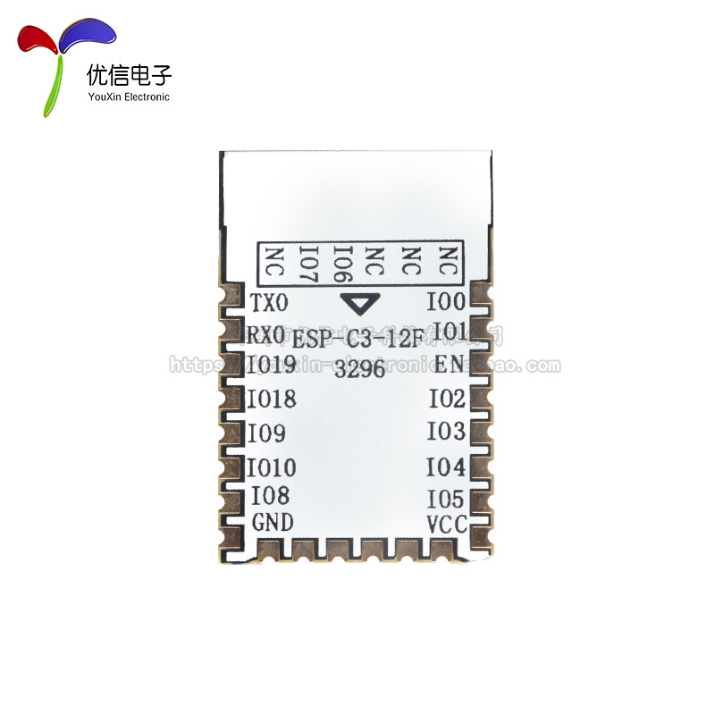
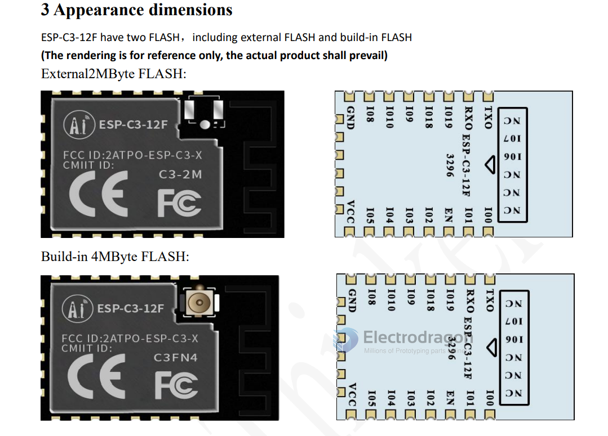
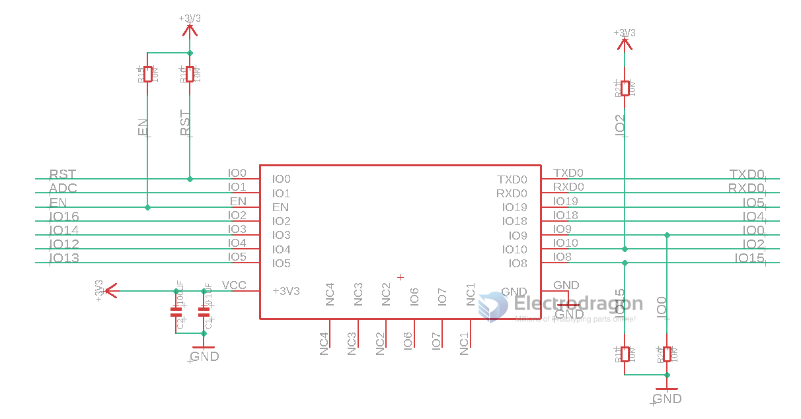
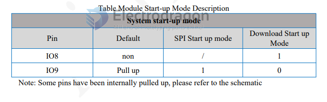

# ESP-C3-12F-DAT

- [[ESP-C3-12F-DAT]]

## Setup Peripheral 

## Re-map Pin Definitions 

| ! ESP-C3-12F | ESP-12F Left | ESP-12F Right | ESP-C3-12F Right |
| ------------ | ------------ | ------------- | ---------------- |
| Reset        | IO0          | TXD0          | TXD0             |
| ADC          | IO1          | RXD0          | RXD0             |
| EN           | EN           | IO5           | IO19             |
| IO16         | IO2          | IO4           | IO18             |
| IO14         | IO3          | IO0           | IO9              |
| IO12         | IO4          | IO2           | IO10             |
| IO13         | IO5          | IO15          | IO8              |
| 3V3          | 3V3          | GND           | GND              |

* Extra Pins from front-side left-to-right: NC1 NC2 NC3 IO6 IO7 NC4

## Boot Mode

* IO8 should float, otherwise USB Bootmode only 

## ref 

- [[ESP32-C3-dat]]