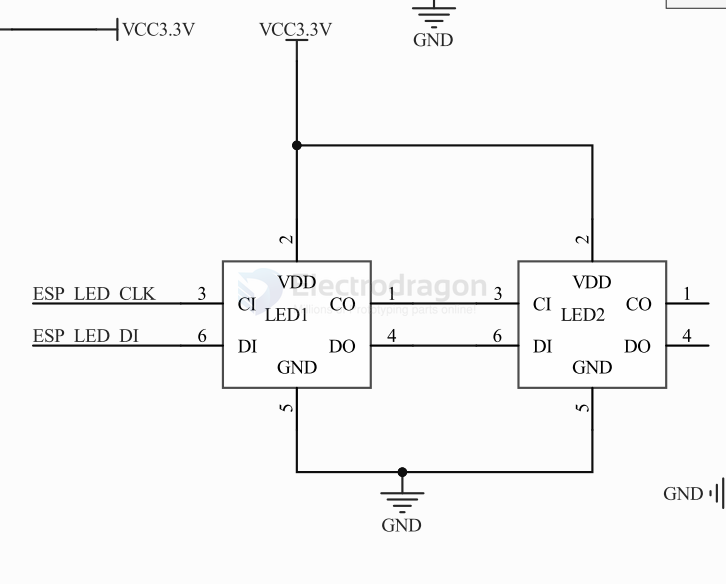

# APA102-2020-dat

- [[APA102_2020_LED-DS.pdf]]

## SCH 

## code 

    #include "FastLED.h"
    #include "pin_config.h"

    // How many leds in your strip?
    #define NUM_LEDS 1

    #define DATA_PIN APA102_DATA

    #define CLOCK_PIN APA102_CLOCK

    static uint32_t APA102_RGB_Data[] = {CRGB::Red, CRGB::Green, CRGB::Blue, CRGB::Black};

    // Define the array of leds
    CRGB leds[NUM_LEDS];

    void setup()
    {
        FastLED.addLeds<APA102, DATA_PIN, CLOCK_PIN, BGR>(leds, NUM_LEDS);
        FastLED.setBrightness(50);
    }

    void loop()
    {
        for (int i = 0; i < 4; i++)
        {
            leds[0] = APA102_RGB_Data[i];
            FastLED.show();
            delay(1000);
        }
    }