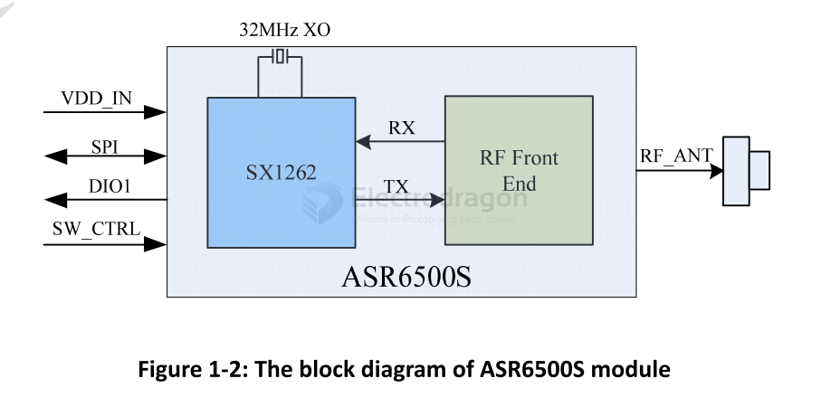

# ASR6500-dat

The ASR6500S is a LoRa SIP module integrated with RF front end and LoRa radio transceiver SX1262 which supports LoRa® and FSK modulation.

LoRa technology is a spread spectrum protocol optimized for low data‐rate ultra‐long range and ultra‐low power communication for LPWAN application. 

- [[ASR6500S_Datasheet_toCustomer_V0.3.pdf]]

## ref 

- [[lora-dat]]