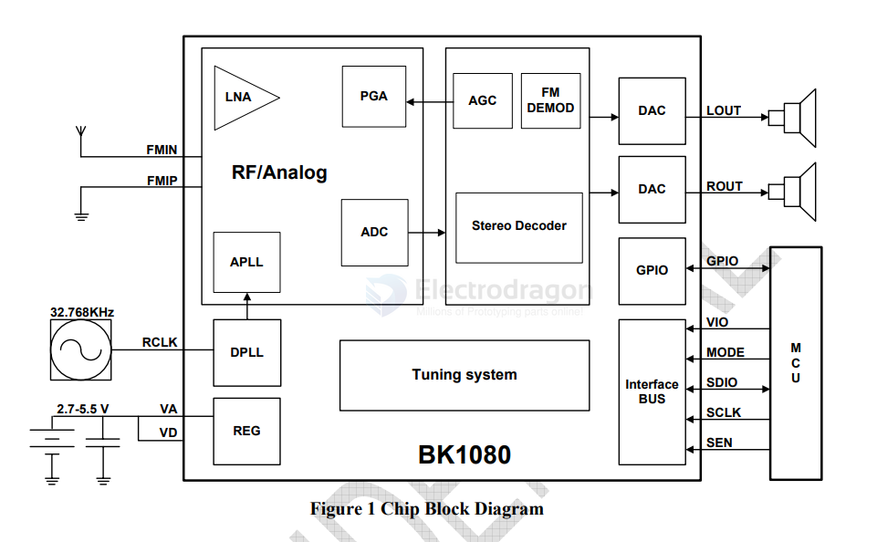
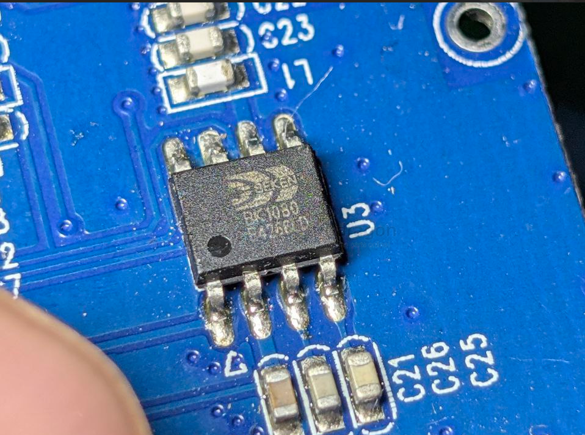

# BK1080-dat

- [[beken-dat]] - [[BK1080-dat]] - [[radio-dat]]

- datasheet == [[BK1080.pdf]]

BK1080

The BK1080 FM receiver employs a low-IF architecture, mixed signal image rejection and all digital demodulation technology. The station scan of BK1080 searches radio stations based on both the channel RSSI estimation and signal quality assessment, increases the number of receivable stations while avoids false stops. BK1080 enables FM radio reception with low power, small board space and minimum number of external components. 

2 Features
- Support 65~108 MHz band
- Automatic gain control
- Automatic frequency control
- Seek tuning
- Receive signal strength indicator
- Channel quality assessment
- Stereo decoder
- Automatic stereo/mono switching
- Automatic noise suppression
- 50us/75us de-emphasis
- 2.5 ~ 5.5 V supply voltage
- Wide range reference clock supported
- 32.768KHz crystal oscillator
- I2C and 3-wires control interface
- 4x4 mm 24-pin QFN package 3x3 mm 20-pin QFN package TSSOP 16-pin package SOP16-pin package SOP8-pin package 

