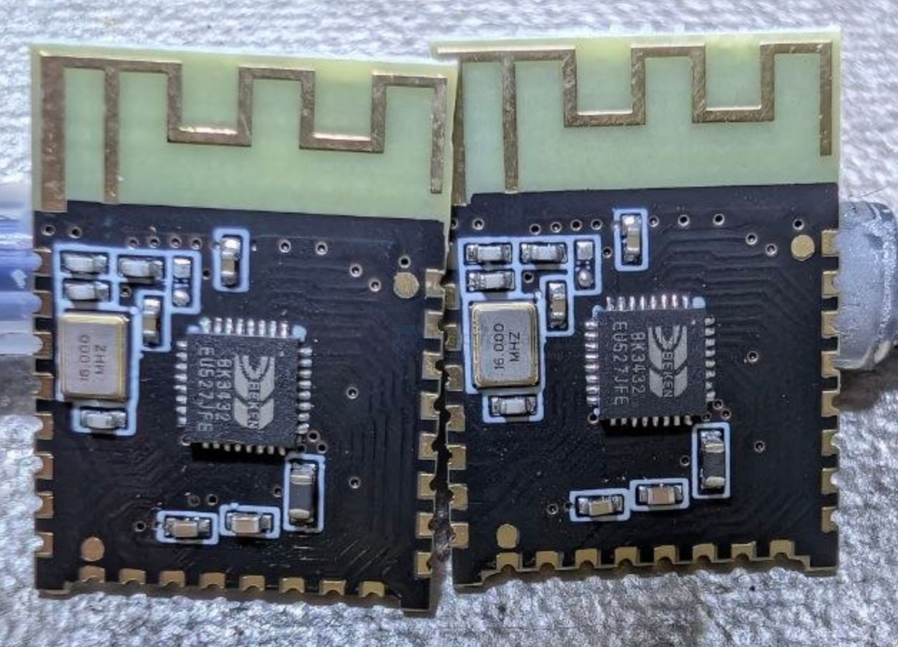
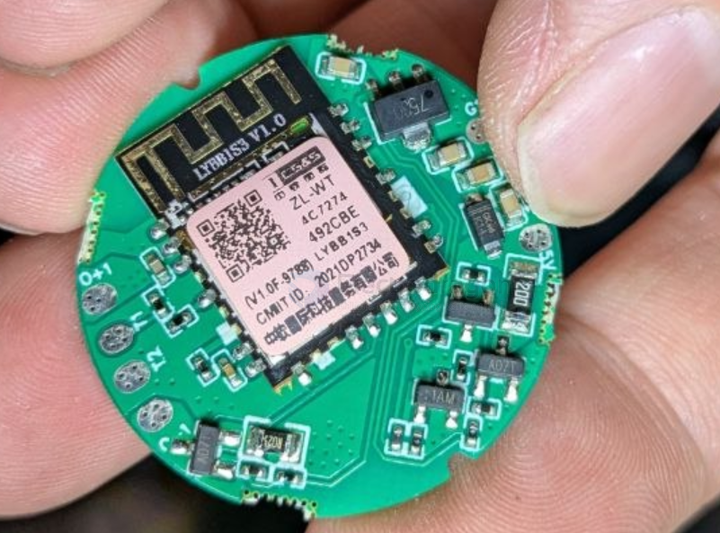
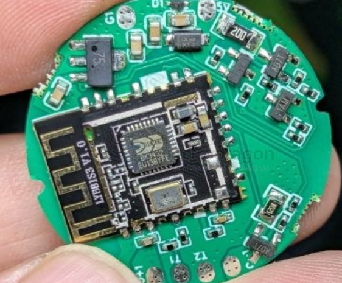

# BK3432-dat

- [[Beken-dat]] - [[BK3432-dat]] - [[EY-23A-dat]] - [[EY-dat]]

- [[BLE-dat]] - [[bluetooth-dat]] 

## Info 

chip info, datasheet, etc.

### Overview

https://www.bekencorp.com/en/goods/detail/cid/17.html

The BK3432 chip is a highly integrated `Bluetooth 5.0` dual mode data SoC with 2 Mbps data rate supported. 

It integrates a high-performance RF transceiver, baseband, MCU, rich feature peripheral units, programmable protocol and profile to support Bluetooth classic and low energy application. 

The Flash program memory makes it suitable for customized applications.

### Features

-  Bluetooth® SIG Bluetooth Dual Mode 5.0 compliant
-  Low-power 2.4GHz Transceiver
-  MCU integrated
-  160 KB programmable Flash for Program and 20 KB RAM for Data
-  Program code read protection
-  Operation voltage from 2.0 V to 3.6 V
-  Clock
-  16 MHz crystal reference clock
-  64 MHz digital PLL clock
-  32 kHz ring oscillator
-  External 32 kHz crystal oscillator
-  MCU can run with any clock source with internal frequency divider
-  Interface and peripheral units
-  JTAG, I2C, SPI interface
-  Two UART interface
-  Multi-channels PWM output
-  On-chip 10 bit general ADC
-  GPIO with multiplexed interface functions
-  True random number generator
-  Typical Package Type
-  32-pin QFN 4x4

## App. 

## board 

iwarm家的温控智能穿戴控制板，有app,ble通讯的，当然重写程序也可以玩别的

- [[LDO-dat]] 

## ref 

- [[BK3432]] 
