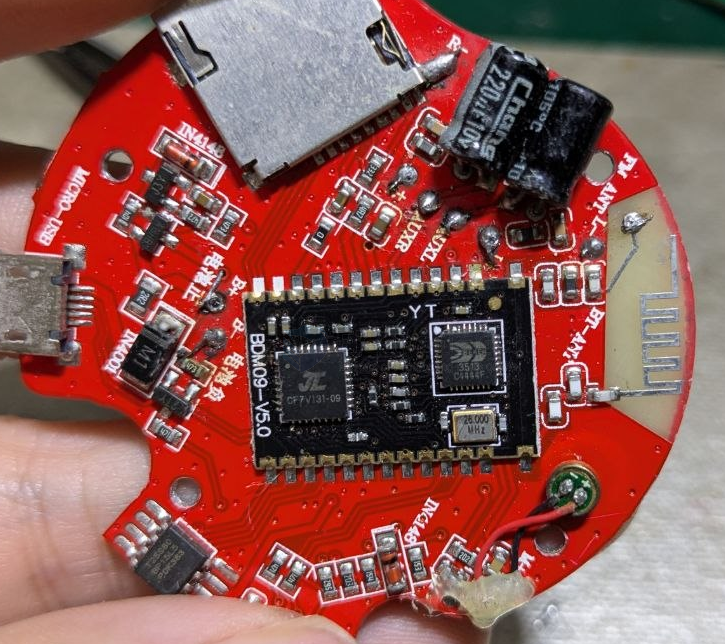
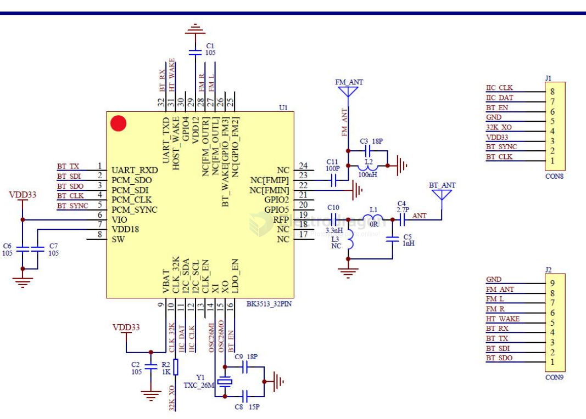
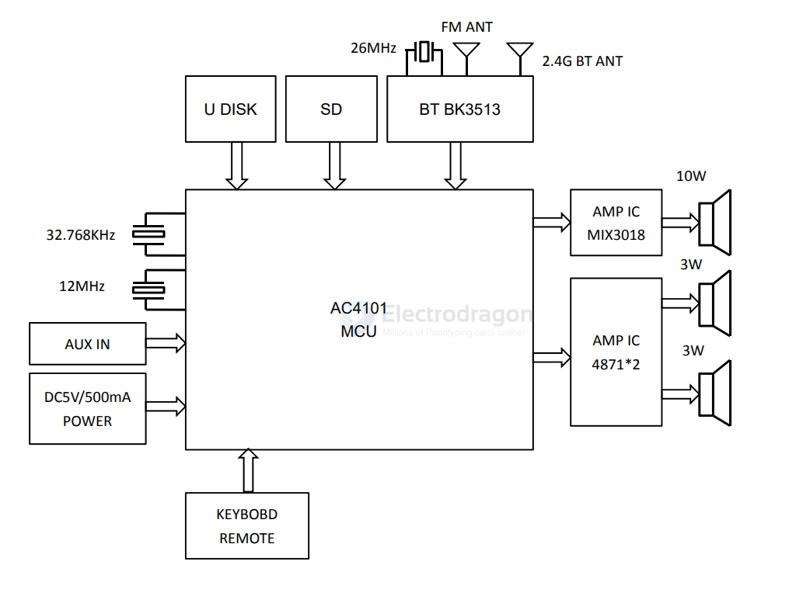
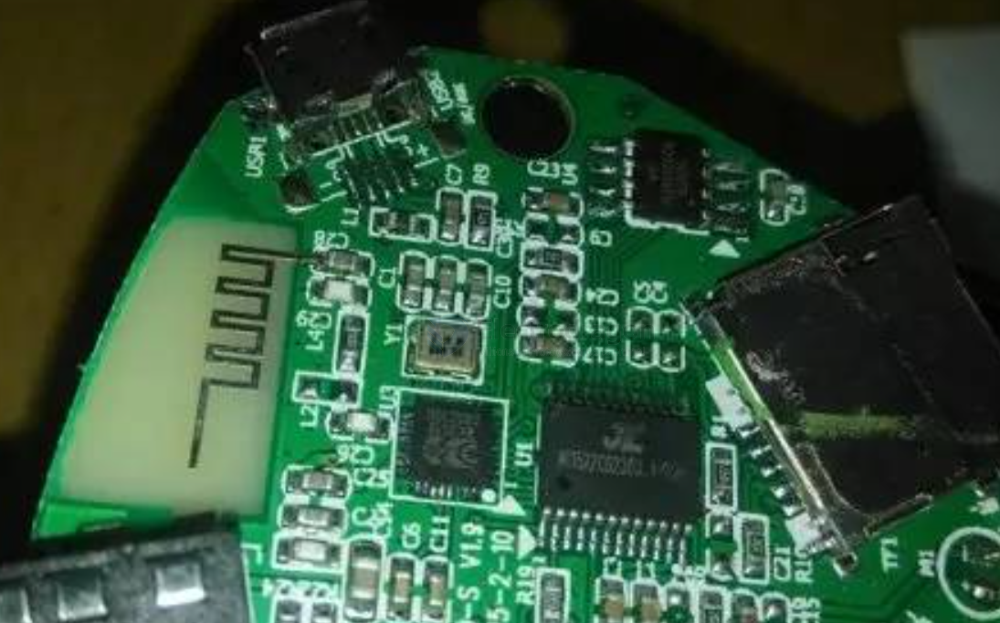

# BK3513-dat

- datasheet == X 

- [[BK3513-dat]] - [[beken-dat]]

- [[AC410x-dat]] 
  
- [[L2CAP-dat]]

The BK3513 most commonly refers to an integrated circuit (IC) chip manufactured by BEKEN, a single-chip radio and baseband processor often used in Bluetooth modules, controllers (such as ShanWan PS3 gamepads), and wireless IoT devices.

## SCH

AC4101

JL AC1522C6230Q

SPI FLASH芯片，8M-BIT大小，应该用来起缓冲作用以及存储一些开机音频、搜索到的FM电台频率吧。

BK3513作为低成本蓝牙控制器，广泛应用于智能家居、健康监测等低功耗设备中。在与 [[ESP32-dat]] 的通信中，[[L2CAP-dat]] 协议因支持面向连接的可靠传输，成为数据交互的首选方案。但实际开发中常出现以下问题：

- 连接建立后频繁断开
- 数据传输速率远低于理论值
- 认证失败导致通信被拒绝

L2CAP协议栈架构

ESP-IDF的蓝牙协议栈基于Bluedroid实现，L2CAP层位于HCI（主机控制器接口）与RFCOMM（射频通信）之间，负责数据的分段与重组。关键代码实现位于components/bt/host/bluedroid/bta/jv/bta_jv_main.c，定义了L2CAP连接管理的核心函数：

1. PSM值不匹配
2. 
BK3513默认使用动态PSM（协议/服务多路复用器）0x1001，而ESP-IDF示例中常使用0x1000。在examples/bluetooth/bluedroid/classic_bt/bt_l2cap_client/main/main.c中定义：

    34:#define BT_L2CAP_DYNMIC_PSM           0x1001

若双方PSM值不一致，将直接导致连接请求被拒绝。