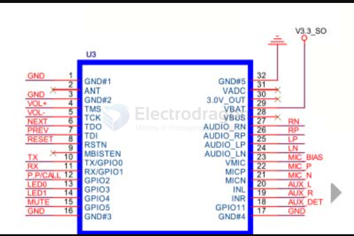
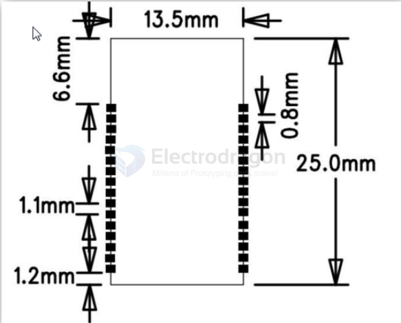

# bk8000-dat 

## Introduction 

* This module uses the master Beken (Broadcom) is BK8000L chip module provides high-quality sound and compatibility, overall better performance.
* Bluetooth module uses driver-free way, customers just need to block access to applications, you can quickly and easily implement wireless transmission of music, enjoy wireless music fun.
* SPP supports data transmission, while supporting the key and AT serial command control, SPP and audio can be performed simultaneously.
* Can store six paired devices, the module is automatically switched back even to the last paired device. If six paired devices simultaneously open, then automatically connect to the last paired device.

## Applications

This module is mainly used for short distance transmission of music, you can easily and notebook computers, mobile phones, PDA and other digital production:

* Bluetooth devices connected to the product, wireless transmission of music.
* Stereo Bluetooth speakers;
* Bluetooth stereo headphones;
* Bluetooth phone;
* Bluetooth control and multimedia equipment;
* Bluetooth SPP serial data transmission.

## Basic Features 

* Bluetooth v2.1 + EDR,
* A2DP v1.2, 
* AVRCP v1.0, 
* HFP v1.5, 
* GAVDP1.2,
* HSP1.2, 
* IOP。

## Specifications 
* Model EB8000
* Bluetooth specification Bluetooth V2.1
* Supply voltage DC2.8-4.2V, ≤2.9V automatic shutdown, ≤3.1V alarm
* Bluetooth protocol HFPV1.5, A2DPV1.2, AVRCPV1.4, HSP1.2, GAVDP1.2, IOP
* Working current ≤60mA
* Standby current <500uA
* Temperature range -40ºC ~ + 85ºC
* Wireless transmission range ≤10 meters
* Transmission power Class2 4dbm
* Sensitivity -80dBm <0.1% BER
* Frequency Range 2.4GHz ~ 2.480GHz
* External Interface Serial (TTL), connected to the PC need MAX232
* SBC decoding audio performance
* Module size 25x13.5x1.8mm
* Adapter plate size 31x25mm

## SDK 

### AT Commands 

* **[See the demo wiring video here](https://www.youtube.com/watch?v=z4KTndMXxmM)**
* Other users demo video:  [BK8000L Bluetooth module HFP test](https://www.youtube.com/watch?v=p5ptruefUnM)
* there are two pins on the breakout board has no mark, please notice
* Use external power source 3.6V on Vbat and gnd, wiring CH340G to RX-TX, TX-RX and GND-GND.
* Logic level of uart is 3V3! not 5V
* All the at commands end up with \r\n (new line)
* Default baudrate 9600
  
####  Basic Controll 
Serial instruction Parameter Description Example
* CA enters pairing AT + CA \r\n
* CB exit pairing AT + CB \r\n
* CC last paired device to connect AT + CC \r\n
* CD disconnected AT + CD \r\n
* CE incoming call AT + CE \r\n
* CF reject calls AT + CF \r\n
* CG hang AT + CG \r\n
* CH Redial AT + CH \r\n
* CK volume plus AT + CK \r\n
* CL volume reduction AT + CL \r\n
* CO channel switching AT + CO \r\n
* CW reserved.
* CX reserved. 
* CZ clear memory AT + CZ \r\n
* CP off AT + CP \r\n
* CV Open Mobile VOICE AT + CV \r\n
* CM multi-language switching AT + CM \r\n
* CMM <number> :( 0-4) to set the number of multi-lingual AT + CMM4 \r\n
* CT test mode AT + CT \r\n
* MA Music Play / Pause AT + MA \r\n
* MC music stops AT + MC \r\n
* MD at an AT + MD \r\n
* ME on an AT + ME \r\n
* Fast forward MF AT + MF \r\n
* MH rewind AT + MH \r\n

### Inquiry 

Bluetooth serial command Description Example return information

* ERR error ERR \r\n
* OK control command recognition is complete OK \r\n   
* MR inquiry Bluetooth address AT + MR \r\n AD: 111111111111 \r\n
* MP PIN code query AT + MP \r\n PN: 0000 \r\n
* MN Bluetooth name query AT + MN \r\n NA: EB8000L \r\n
* MQ query software version AT + MQ \r\n XZX-V1.2 \r\n

* MO Discover Bluetooth connection status AT + MO \r\n 
    * connection success: "C1 \r\n"
    * No connection: "C0 \r\n"

* MV inquiry Bluetooth playback status AT + MV \r\n 
    * Play: "MB \r\n"
    * Pause: "MA \r\n"
    * Disconnect: "M0 \r\n"

* MY inquiry Bluetooth HFP status AT + MY \r\n Disconnect: "M0 \r\n"
    * Connection: "M1 \r\n"
    * Caller: "M2 \r\n"
    * Outgoing: "M3 \r\n"
    * Call: "M4 \r\n"

### Feedback Send from Module 
* II connection succeeds \r\n
* IA Disconnect \r\n
* MA   Pause: MA \r\n
* MB   Play: MB \r\n
* IR- <Number> call number IR-136XXXXXXX
* PR- <Number> Outgoing number PR-136XXXXXXX
* ON Bluetooth is turned ON \r\n

### SPP Commands (e.g. change password, send data) 

| Example Commands | Feedback            | Description                   |
| ---------------- | ------------------- | ----------------------------- |
| AT+MN\r\n        | NA: BK8000L         | Check bluetooth name          |
| AT+MO\r\n        | C0                  | check connection status       |
| -                | II II II  | Connected connection feedback |
| AT+MO\r\n        | C1                  | check connection status       |

Note:

- Make sure module paied with your device (phone)
- Use BlueSPP app from Google play, make sure BlueSPP is connected 
- Run following commands.

Commands:

APT + SPPXXXX four-digit password (8888),

- Open SPP by using password
- e.g. APT + SPPXXXX \r\n as long as the hair once,
- The password is correct: OK \r\n
- Password Error: ERR \r\n

APT + XXXXXXX total data length of each time send/receive, it recommended not to exceed 64byte

 - e.g. APT + XXXXXX \r\n
 - The data sent to the mobile phone side
 - Success: OK \r\n
 - Error: ERR \r\n

APR + XXXXXXX total data length of each time send/receive, it recommended not to exceed 64byte

- e.g. APR + XXXXXX \r\n
- Data received from the mobile terminal
- Data sent over the phone
- APR + XXXXXX \r\n

## HDK

### Module Pin Definitions 

| Number IO | IO Name           | IO Description                                            |
| --------- | ----------------- | --------------------------------------------------------- |
| 1         | GND               | ground antenna _GND                                       |
| 2         | ANT               | antenna (default built-in antenna, external disconnect)   |
| 3         | GND               | ground antenna _GND                                       |
| 4         | VOL + (TMS)       | volume up (programming interface)                         |
| 5         | VOL- (TCK)        | Volume down (programming interface)                       |
| 6         | NEXT (TDO)        | under a (programming interface)                           |
| 7         | PREV on (TDI)     | song (programming interface)                              |
| 8         | RSTN              | low reset (programming interface)                         |
| 9         | MBISTEN           | Memory bit check                                          |
| 10        | TX (GPIO0)        | serial TX                                                 |
| 11        | RX (GPIO1)        | serial RX                                                 |
| 12        | PP / CALL (GPIO2) | Play / Pause / receive calls / back / re-pair             |
| 13        | LED0 (GPIO3)      | status indicator                                          |
| 14        | LED1 (GPIO4)      | status indicator                                          |
| 15        | MUTE (GPIO5)      | Mute control (mute low)                                   |
| 16        | GND               | Power ground                                              |
| 17        | AGND              | AUX ground                                                |
| 18        | AUX_DET (GPIO11)  | AUX insertion detection                                   |
| 19        | AUX_R             | AUX right input                                           |
| 20        | AUX_L             | AUX left input                                            |
| 21        | MIC_N             | microphone negative terminal                              |
| 22        | MIC_P             | microphone positive terminal                              |
| 23        | VMIC              | Mike bias voltage                                         |
| 24        | LN                | Audio left channel differential output negative end       |
| 25        | LP                | audio left channel positive differential output terminal  |
| 26        | RP                | audio right channel positive differential output terminal |
| 27        | RN                | audio right channel negative differential output terminal |
| 28        | VBUS              | 5V input charging port (charging is not enabled)          |
| 29        | VBAT              | power input (2.8 ~ 4.2V)                                  |
| 30        | 3V0               | 3V output                                                 |
| 31        | ADC               | ADC input (not enabled)                                   |
| 32        | GND               | Power ground                                              |

Dimension 

## ref 

- [[BT-audio-dat]] - [[bluetooth-dat]]