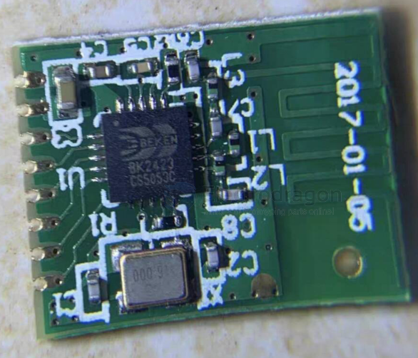

# bk2423-dat

- [[beken-dat]] - [[bk2423-dat]] - [[NRF24L01-dat]] - [[rf-2.4Ghz-dat]] - [[frequency-dat]] - [[rf-dat]]

- BK2423:与nRF24L01高度兼容，但多出一组Bank寄存器（Bank1），初始化时必须配置，否则无法正常工作。
- nRF24L01：原生标准，仅有一组寄存器，初始化流程更简单直接。

空中数据速率
- BK2423:支持250kbps/1Mbps/2Mbps（部分资料提及可达4Mbps）。
- nRF24L01（原版）：通常只支持1Mbps/2Mbps。250kbps是后续版本nRF24L01+才加入的特性。

发射功率
- BK2423：最大输出功率+5dBm，非公开的高功率模式甚至可达+14dBm，信号更强。
- nRF24L01（原版）：严格遵循早期规范，最大输出功率为0dBm（1mW）

## ref 