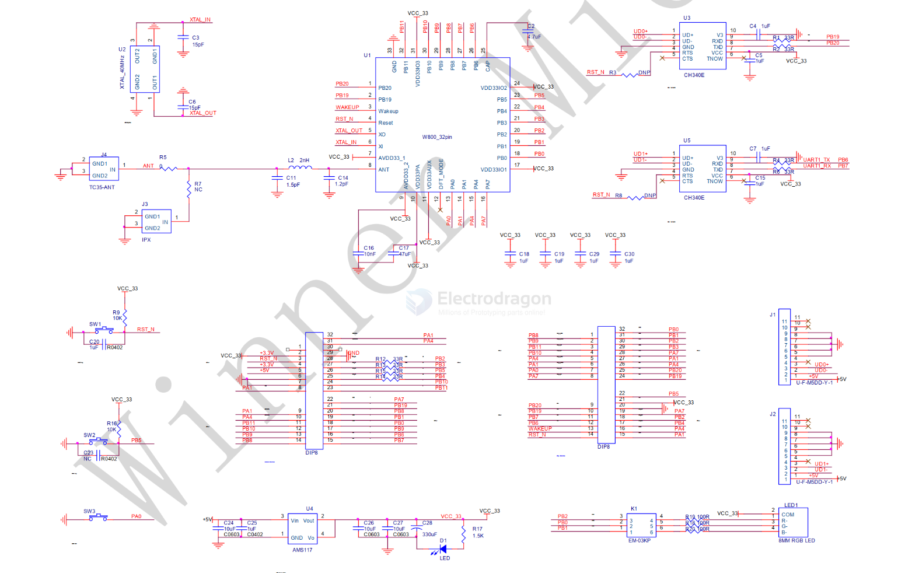

# W800-dat

- [[AI-WB1-dat]] - [[AIT-dat]] - [[ES8311-dat]] - [[W800-dat]] - [[W600-DAT]] - [[bouffalolab-dat]]

- datasheet == [[W800-DS-V3.0.pdf]]

- [[ESP32-LyraT-dat]] - [[ES8311-dat]] 

- [[W800-dat]] - [[W803-dat]] - [[W806-dat]] - [[bouffalolab-dat]]

## arduino 

- https://raw.githubusercontent.com/board707/w80x_arduino/hal-v0.6.0/package_w80x_index.json

Enter the following URL in the additional development board manager URL:

https://raw.githubusercontent.com/board707/w80x_arduino/hal-v0.6.0/package_w80x_index.json

In case of Error: 13 INTERNAL: can not install w80x_duino:csky@2021.04.23 tool use an alternative:

https://raw.githubusercontent.com/board707/w80x_arduino/hal-v0.6.0/package_w80x_test_index.json

If this doesn't work, try any of these link addresses:

http://dl.isme.fun/w80x_arduino/package_w80x_index.json

https://raw.githubusercontent.com/board707/w80x_arduino/hal-v0.6.0/package_w80x_isme_proxy_index.json

## SCH 

W800 SCH 

more schematic - [[w800_arduino_board_v3.1_20240808_schematic.pdf]] - [[w800_arduino_board_v4_20240826_schematic.pdf]]

## ref 

 