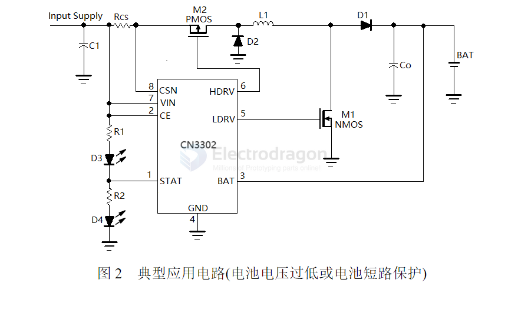
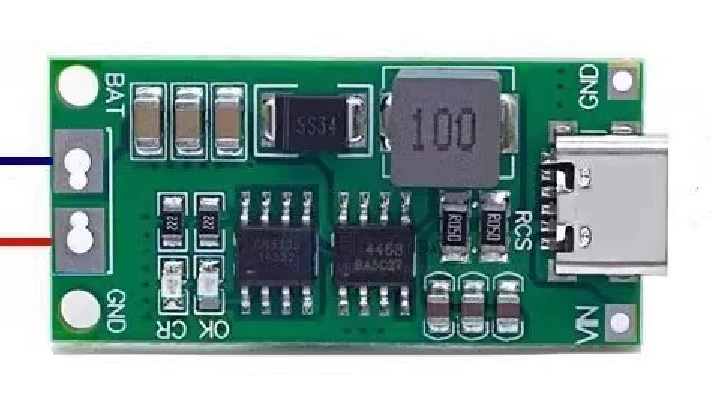

# CN3302-dat

- PFM Boost Dual-Cell Lithium Battery Charging Control IC

- [[Consonance-Elec-CN3302-DS.pdf]]

The CN3302 is a PFM boost dual-cell lithium battery charging control IC operating within a voltage range of 2.75V to 6.5V. The CN3302 utilizes constant current (CC) and quasi-constant voltage mode (Quasi-CVTM) for battery charging management. It integrates a reference voltage source, inductor current detection unit, battery voltage detection circuit, and external field-effect transistor (FET) driver circuit, offering advantages such as a minimal number of external components and a simple circuit design.

When the input power is connected, the CN3302 enters the charging state, controlling the external N-channel MOSFET to turn on, causing the inductor current to rise. When the current reaches the upper limit set by the external current-sensing resistor, the external N-channel MOSFET turns off, and the inductor current decreases, transferring the energy from the inductor to the battery. When the inductor current drops to the lower limit set by the external current-sensing resistor, the external N-channel MOSFET turns on again, repeating this cycle.

When the BAT pin voltage first reaches the internally set 8.4V (typical value), the CN3302 enters the quasi-constant voltage charging mode, charging the battery with a smaller current. In this mode, when the BAT pin voltage reaches 8.4V, the charging process ends, and the external N-channel MOSFET remains off. When the BAT pin voltage drops to the recharge threshold, the CN3302 re-enters the charging state.

The CN3302 supports a maximum operating frequency of up to 1MHz.

When the battery voltage is lower than the input voltage or when the battery is short-circuited, the CN3302 uses a small current to continue charging the battery through the combined operation of the external N-channel MOSFET and P-channel MOSFET, providing protection to the battery.

Additional features include chip enable input, over-temperature protection, and status indicator output.

The CN3302 is available in an 8-pin SOP8 package.

## SCH App 

- [[AO4468-dat]] - [[mosfet-dat]]

## ref 

- [[Consonance-dat]]

- [[CN3302]]