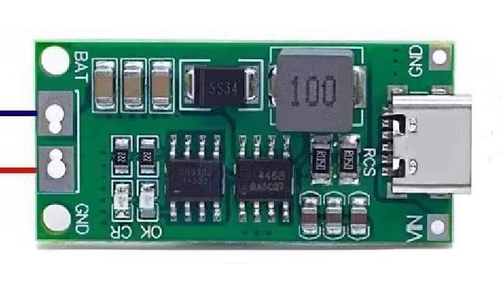
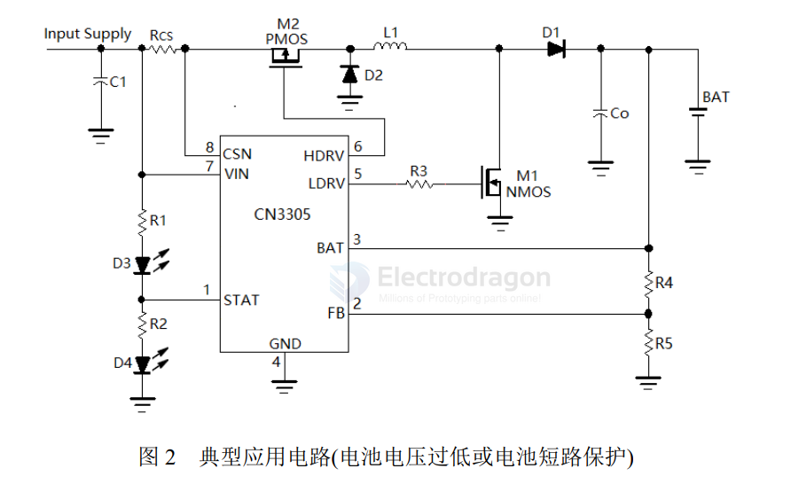

# CN3305-dat

- [[passive-BMS-dat]] - [[battery-pack-dat]] - [[battery-dat]]

- RCS 

## FB 

VBAT = 1.205 ⅹ (1+R4∕R5)

for - [[LFP-dat]] 

    = 1.205 x ( 1 + 510k ∕ 100k) = 1.205 ⅹ 6.1 = 7.36V
    = 1.205 x ( 1 + 800k ∕ 100k) = 1.205 ⅹ 9 = 10.845V
    = 1.205 x ( 1 + 1000k ∕ 90k) = 1.205 ⅹ 12.11 = 14.6V

for - [[li-battery-dat]]

## SCH 

- including low voltage detection 
- [[battery-protection-dat]] - short circuit - [[SCP-protection-dat]]

## ref 

- [[consonance-dat]]