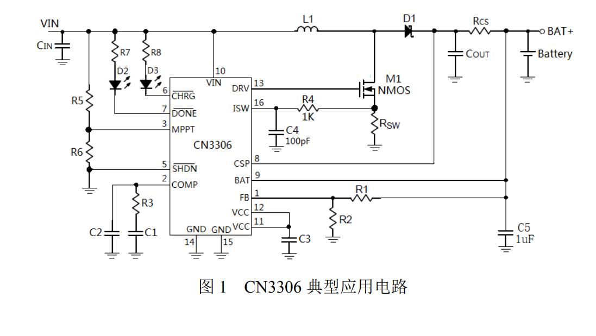

# CN3306-dat

- [[MPPT-dat]] - [[solar-dat]]

CN3306 is a current-mode, fixed-frequency PWM boost-type multi-battery charging management IC. The CN3306 features an input voltage range of 4.5V to 32V, requires few external components, and is simple and flexible to use. It can be applied to charging management for lithium batteries, lithium iron phosphate batteries, or lithium titanate batteries.

Features:
- PWM boost mode charging management
- Input voltage range: 4.5V to 32V
- Adaptive charging current function
- Supports solar panel maximum power point tracking, can be powered by solar panels
- Switching frequency: 330kHz

- [[resistor-feedback-dat]]

## ref 

- [[diode-dat]] - [[DCDC-down-dat]] - [[resistor-feedback-dat]] - [[resistor-dat]]

- [[consonance-dat]]