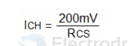

# CN3722-dat

5A, Multi-Chemistry Battery Charger IC With Photovoltaic Cell MPPT Function

http://www.consonance-elec.com/seriesCN3722-E.html

- [[OPM1146-dat]]

Wide Input Voltage: 7.5V to 28V

## CSP 

Positive  Input  for  Charging  Current  Sensing.  CSP  and  BAT  pin  measure  the  
voltage drop across the sense resistor RCS to provide the current signals required. 

### Charge Current Setting 

The full-scale charge current, namely the charge current in constant current mode, is decided by the following formula: 

Ich = 200mv / Rcs 

Where:        
- Ich is the full scale charge current 
- Rcs is the resistor between the CSP pin and BAT pin

if Ich = 3A then Rcs = 0.067 ohm

if Rcs = 0.165 ohm then Ich = 1.2A

### Set the Regulation Voltage in Constant Voltage Mode 

As shown in Figure 1, battery voltage is fed back to the FB pin via the resistor divider composed of R6 and R7.  
CN3722 determines the charging status based on the FB pin voltage. 

When the FB voltage approaches 2.416V, the charger enters constant voltage mode. In constant voltage mode, the charge current gradually decreases, and the battery voltage remains unchanged.  

Considering the FB pin’s bias current, the regulation voltage in constant voltage mode is determined by the following equation:  

    Vbat = 2.416 × (1 + R7 / R6) + Ib × R7

Where Ib is the FB pin’s bias current, typically 50nA.  

From the above equation, we can see that an error is introduced due to the bias current Ib; the error is Ib × R7.  

If R7 = 500kΩ, then the error is about 25mV. So this error should be taken into account when designing the resistor divider.  

The regulation voltage range that can be set is from 3V to 25V.

- [[resistor-feedback-dat]]

## ref 

- [[CN3722.pdf]]

- [[diode-dat]]
