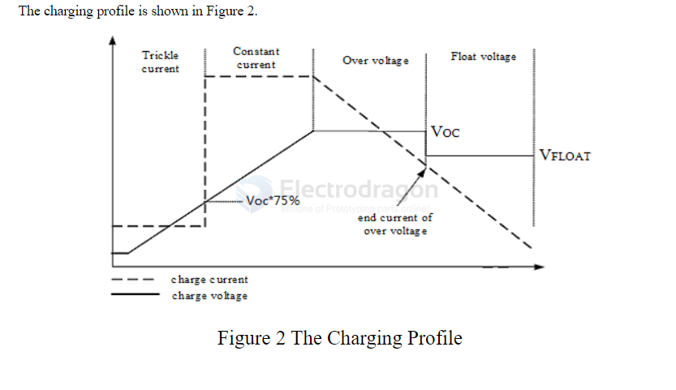
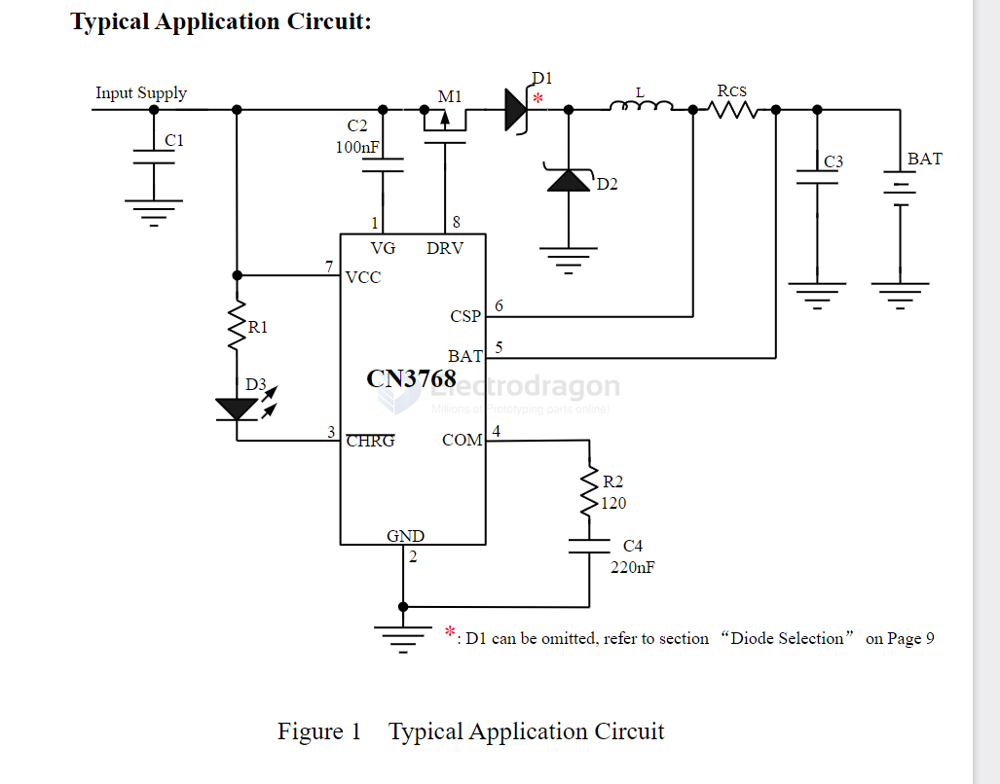
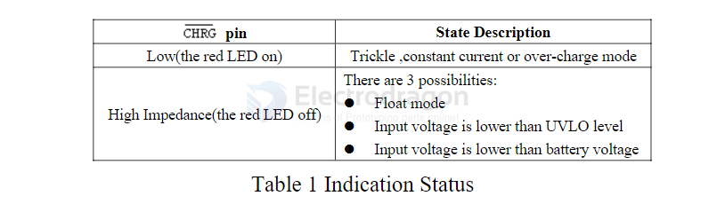

# CN3768-dat

## Features

- Wide Input Voltage: 6.6V to 30V 
- Complete Charger Controller for 12V Lead-Acid Battery 
- Charge Current Up to 4A 
- High PWM Switching Frequency: 315KHz 
- Fixed Over-Charge Voltage 
- Charging Current is programmed with a sense resistor 
- Automatic Conditioning of Deeply Discharged Batteries 
- Automatic Recharge 
- Charger Status Indication 
- Soft Start 
- Battery Overvoltage Protection 
- Operating Ambient Temperature －40°C to  ＋85°C 
- Available in 8 Pin SOP Package 
- Pb-free , RoHS Compliant,   and Halogen Free

## info 

The CN3768 charging system incorporates several automatic features to optimize battery health and longevity. 

**Deeply discharged batteries** are initially trickle charged at 17.5% of the programmed constant charge current. This continues until the cell voltage reaches 75% of the regulation voltage in over-charge mode. 

The **over-charge phase** ends when the charging current decreases to 38% of the constant charge current, at which point the system transitions to float charge mode. 

If the battery voltage subsequently drops below 83.95% of the over-charge voltage while in float-charge mode, a **new charge cycle** automatically begins. 

Furthermore, the CN3768 automatically enters **sleep mode** when the input voltage falls below the battery voltage, conserving power.

## typical APPs 

## Status Indication 

The CN3768 has one open-drain status outputs: CHRG.  CHRG is pulled low when the charger is in trickle charge mode, constant current mode and over charge mode. 

In float mode,  CHRG becomes high impedance. 

When the battery is not present, the charger charges the output capacitor to the float-charge voltage.   

The CHRG  pin should be tied to ground if charge status indication is not needed. 

The table 1 lists the indicator status and its corresponding charging status. It is supposed that red LED is 
connected to  CHRG pin. 

## ref 

[[DSE-CN3768.pdf]]